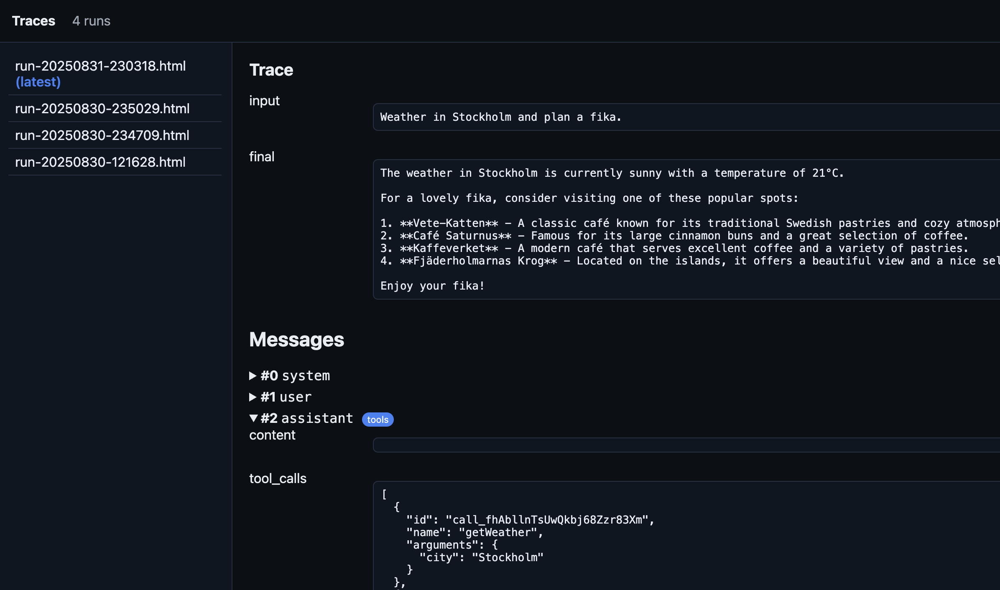
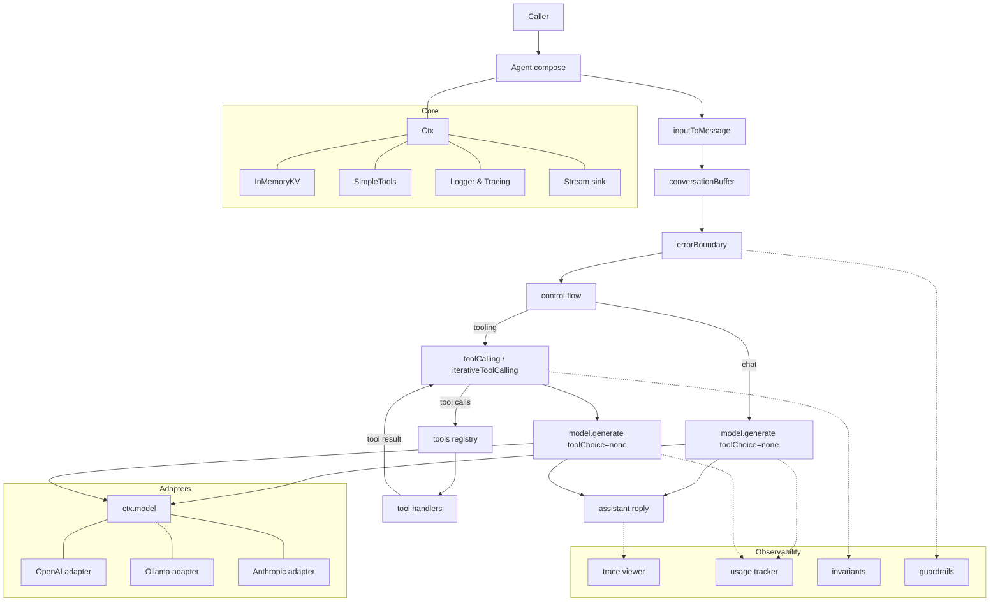

> Grit‑powered agents. Quiet, determined, relentlessly useful.

**Sisu** is a lightweight TypeScript framework for turning intent into action. Inspired by the Finnish idea of sisu—calm resolve under pressure—Sisu favors explicit tools, predictable plans, and built‑in guardrails. No ceremony, no mystery: compose, decide, do.

## Why Sisu?
- Everything is middleware: compose planning, tools, routing, safety like you compose Express/Koa apps.
- One ctx, zero magic: a single typed context flows through; what you see is what runs.
- Typed tools, explicit loops: tool calls and control flow are first‑class and deterministic.
- Provider‑agnostic, adapter‑friendly: OpenAI, Ollama (local), or your own HTTP client.
- Built‑in observability: structured logs, redaction, and an HTML trace viewer per run.
<div align="center">



**Visual Trace Viewer**  
Get instant feedback on every run with a beautiful, interactive HTML trace. Inspect every message, tool call, and decision in detail.

---


**CLI Trace Logs**  
Stay in flow with structured, color-coded logs right in your terminal. Perfect for rapid iteration and debugging.

</div>

## 90‑Second Example
Turn intent into action with a clear, inspectable pipeline.

**Install the packages used below:**
```bash
npm i \
  @sisu-ai/core @sisu-ai/adapter-openai \
  @sisu-ai/mw-register-tools @sisu-ai/mw-conversation-buffer \
  @sisu-ai/mw-tool-calling \
  @sisu-ai/mw-trace-viewer @sisu-ai/mw-error-boundary \
  zod dotenv
```

**Write something awesome with code:**

```ts
import 'dotenv/config';
import { Agent, createConsoleLogger, InMemoryKV, NullStream, SimpleTools, type Tool, type Ctx } from '@sisu-ai/core';
import { registerTools } from '@sisu-ai/mw-register-tools';
import { inputToMessage, conversationBuffer } from '@sisu-ai/mw-conversation-buffer';
import { errorBoundary } from '@sisu-ai/mw-error-boundary';
import { toolCalling /* or iterativeToolCalling */ } from '@sisu-ai/mw-tool-calling';
import { openAIAdapter } from '@sisu-ai/adapter-openai';
import { traceViewer } from '@sisu-ai/mw-trace-viewer';
import { z } from 'zod';

// Tool
interface WeatherArgs { city: string }
const weather: Tool<WeatherArgs> = {
  name: 'getWeather',
  description: 'Get weather for a city',
  schema: z.object({ city: z.string() }),
  handler: async ({ city }) => ({ city, tempC: 21, summary: 'Sunny' }),
};

// Model
const model = openAIAdapter({ model: 'openai/gpt-oss-20b', baseUrl: 'http://127.0.0.1:1234/' });

// Ctx
const ctx: Ctx = {
  input: process.argv.slice(2).join(' ') || 'What is the weather in Malmö?',
  messages: [{ role: 'system', content: 'You are a helpful assistant.' }],
  model,
  tools: new SimpleTools(),
  memory: new InMemoryKV(),
  stream: new NullStream(),
  state: {},
  signal: new AbortController().signal,
  log: createConsoleLogger(),
};

// Minimal pipeline: no classifier, no switch, no manual loop
const app = new Agent()
  .use(errorBoundary(async (err, c) => {
    c.log.error(err);
    c.messages.push({ role: 'assistant', content: 'Sorry, something went wrong.' });
  }))
  .use(traceViewer())
  .use(registerTools([weather]))
  .use(inputToMessage)
  .use(conversationBuffer({ window: 8 }))
  .use(toolCalling); // 1) generate(..., auto) → maybe run tools → 2) finalize with none

await app.handler()(ctx);
const final = ctx.messages.filter(m => m.role === 'assistant').pop();
console.log('\nAssistant:\n', final?.content);
```

## Core Ideas
- Koa‑style middleware: `(ctx, next) => { …; await next(); … }` gives “onion” control—before/after work is explicit and composable.
- Single ctx: no hidden globals. Everything lives on `ctx` so it’s easy to reason about and test.
- Typed tools: tool schemas inform tool loops and protect your handlers.
- Control flow is code: `sequence`, `branch`, `switchCase`, `loopUntil`, `parallel`, `graph`—you read the plan in the code.
- Deterministic modes: timeouts, bounded loops, retries are explicit—in your hands.
- Observability by default: leveled logs, redaction, and a trace viewer that writes `traces/run-*.html`.

## How it works
This is a typical use case flow. However, as SIsu is very flexible by nature, it can vary. But this is the core idea.



* **Middleware pipeline**: your `Agent` runs a Koa-style chain (`ctx`, `next`). Each middleware reads or updates `ctx` and calls `await next()` unless it short-circuits. Core stays tiny; everything else is opt-in middleware.
* **Adapters**: middleware like `toolCalling` and control-flow ultimately call `ctx.model.generate(...)`. The model is provided by an adapter (e.g. OpenAI, Ollama or Anthropic), but any provider can implement the `LLM.generate` contract.
* **Tools**: the tools registry holds named handlers with zod schemas. `toolCalling` does a first turn with `toolChoice auto`, runs each unique tool pick, then a final completion with `toolChoice none`. `iterativeToolCalling` repeats the “auto” turn until no more tool calls.
* **Core services**: `Ctx` carries messages, tools, memory, logger, stream, state; `InMemoryKV` and `SimpleTools` are minimal defaults.
* **Observability**: tracing, usage, invariants, guardrails are middlewares that tap the flow without changing behavior.


## Run your first mile
- OpenAI hello:
  - `cp examples/openai-hello/.env.example examples/openai-hello/.env`
  - `npm run ex:openai:hello`
  - Open `examples/openai-hello/traces/trace.html`
- Ollama hello (local):
  - `ollama serve && ollama pull llama3.1:latest`
  - `npm run ex:ollama:hello`
  - Open `examples/ollama-hello/traces/trace.html`

## Find your inner strength
- [packages/core](packages/core/README.md)
- Adapters: [OpenAI](packages/adapters/openai/README.md), [Ollama](packages/adapters/ollama/README.md)
- Adapters: [OpenAI](packages/adapters/openai/README.md), [Ollama](packages/adapters/ollama/README.md), [Anthropic](packages/adapters/anthropic/README.md)
- Middlewares:
  - [@sisu-ai/mw-conversation-buffer](packages/middleware/conversation-buffer/README.md)
  - [@sisu-ai/mw-control-flow](packages/middleware/control-flow/README.md)
  - [@sisu-ai/mw-error-boundary](packages/middleware/error-boundary/README.md)
  - [@sisu-ai/mw-react-parser](packages/middleware/react-parser/README.md)
  - [@sisu-ai/mw-register-tools](packages/middleware/register-tools/README.md)
  - [@sisu-ai/mw-tool-calling](packages/middleware/tool-calling/README.md)
  - [@sisu-ai/mw-usage-tracker](packages/middleware/usage-tracker/README.md)
  - [@sisu-ai/mw-trace-viewer](packages/middleware/trace-viewer/README.md)
  - [@sisu-ai/mw-invariants](packages/middleware/invariants/README.md)
  - [@sisu-ai/mw-guardrails](packages/middleware/guardrails/README.md)

---

# Adapters
Here’s a draft **Adapters** section you can drop into the README. It explains what adapters are, what’s supported, and when to re-use an existing adapter (like OpenAI for LM Studio).

---

## Adapters

Adapters are small shims that let Sisu talk to different LLM providers in a **normalized way**.
Every adapter implements the same `LLM.generate(messages, opts)` contract so you can swap providers without changing your agent code.

| Adapter       | Package                      | Features                                                                               | Notes                                                                                                                         |
| ------------- | ---------------------------- | -------------------------------------------------------------------------------------- | ----------------------------------------------------------------------------------------------------------------------------- |
| **OpenAI**    | `@sisu-ai/adapter-openai`    | ✅ Tool calling, ✅ JSON mode, ✅ Streaming, ✅ Vision (multi-part input), usage reporting | Works with OpenAI API and *any service that is OpenAI-compatible* (e.g. **LM Studio**, **vLLM**, some **OpenRouter** models). |
| **Ollama**    | `@sisu-ai/adapter-ollama`    | ✅ Local inference, ✅ Tool calling, partial streaming                                   | Run local models via [`ollama serve`](https://ollama.com).                                                                    |
| **Anthropic** | `@sisu-ai/adapter-anthropic` | ✅ Tool calling, ✅ Streaming, ✅ Usage reporting                                         | Claude family models. Slightly different tool-call semantics are normalized for you.                                          |

### When to re-use vs. add a new adapter

* If a provider exposes an **OpenAI-compatible API** (LM Studio, vLLM server, some OpenRouter models), you can just use the **OpenAI adapter** with a custom `baseUrl`.

  ```ts
  import { openAIAdapter } from '@sisu-ai/adapter-openai';

  const model = openAIAdapter({
    model: 'gpt-4o-mini',
    baseUrl: 'http://localhost:1234/v1', // e.g. LM Studio
  });
  ```
* A **dedicated adapter** is only needed when a provider:

  * has **different request/response shapes** (e.g. Anthropic),
  * exposes **extra metadata or headers** (usage, rate-limits),
  * or supports **special features** you want to surface in `GenerateOptions`.

## OpenAI

```ts
import { openAIAdapter } from '@sisu-ai/adapter-openai';
const model = openAIAdapter({ model: 'gpt-4o-mini' });
// ctx.model = model
```

| Feature       | Details                                                                                                                                                                 |
|---------------|-------------------------------------------------------------------------------------------------------------------------------------------------------------------------|
| **Env Vars**  | - `OPENAI_API_KEY` or `API_KEY`<br>- `OPENAI_BASE_URL` or `BASE_URL`                                        |
| **Tools**     | ✅ |
| **Images**    | - Multi-part arrays: `{ type: 'text' \| 'image_url' }`<br>- Example: `[{ type: 'text', ...}, { type: 'image_url', ...}]`<br>- See `examples/openai-vision`              |
| **Streaming** | ✅                                                                                                                                                                       |

---

## Ollama (local)

```ts
import { ollamaAdapter } from '@sisu-ai/adapter-ollama';
const model = ollamaAdapter({ model: 'llama3.1' });
// ctx.model = model
```

| Feature       | Details                                                                                                 |
|---------------|---------------------------------------------------------------------------------------------------------|
| **Env Vars**  | - `OLLAMA_BASE_URL` or `BASE_URL` (default `http://localhost:11434`)                                    |
| **Tools**     | ✅ |
| **Images**    | –                                                                                                       |
| **Streaming** | ✅                                                                                                       |

---

## Anthropic

```ts
import { anthropicAdapter } from '@sisu-ai/adapter-anthropic';
const model = anthropicAdapter({ model: 'claude-sonnet-4-20250514' });
// ctx.model = model
```

| Feature       | Details                                                                                                                                          |
|---------------|--------------------------------------------------------------------------------------------------------------------------------------------------|
| **Env Vars**  | - `ANTHROPIC_API_KEY` or `API_KEY`<br>- `ANTHROPIC_BASE_URL` or `BASE_URL`                                                           |
| **Tools**     | ✅ |
| **Images**    | –                                                                                                                                                |
| **Streaming** | ✅                                                                                                                                                |

---


## Configuration (Env & Flags)
- Env vars (adapters)
  - `OPENAI_API_KEY` or `API_KEY`: API key for OpenAI/gateway
  - `OPENAI_BASE_URL` or `BASE_URL`: override base URL for OpenAI adapter
  - `OLLAMA_BASE_URL` or `BASE_URL`: override base URL for Ollama adapter
- Env vars (OpenAI Responses tool)
  - `OPENAI_RESPONSES_BASE_URL`: specific base URL for the Responses API (defaults to `https://api.openai.com`)
  - `OPENAI_RESPONSES_MODEL`: model for Responses (defaults to `gpt-4.1-mini`)
- Env vars (runtime)
  - `LOG_LEVEL`: `debug|info|warn|error` (default `info`)
  - `DEBUG_LLM`: `1|true` to log adapter request/response summaries on errors
- Trace viewer flags
  - CLI: `--trace` (optional `--trace=run.json|run.html`), `--trace-style=light|dark|modern`
  - Env: `TRACE_JSON=1`, `TRACE_HTML=1`, `TRACE_STYLE=light|dark|modern`
- Notes
  - Precedence in examples: CLI flags > env vars. At library level, adapter options in code override env.
  - Adapters accept `baseUrl` in code; env overrides are convenient for examples and scripts.
  - Examples accept a trailing prompt string; use quotes to preserve spaces.

### CLI helpers (core)
- `parseFlags(argv)`: Parses `--k=v`, `--k v`, and boolean flags into a map.
- `firstConfigValue([ENV1, ENV2], flags, env)`: Returns the first defined value by checking CLI flags (kebab-case of env var names) before environment variables.
- Convention: Any env var `FOO_BAR` can be provided as CLI flag `--foo-bar`.

## Debugging Tips
- Set `LOG_LEVEL=debug` to see control‑flow, tool loop, and invariant logs.
- Set `DEBUG_LLM=1` to log redacted HTTP payloads from the OpenAI adapter when a call fails (status + body snippet).
- The trace viewer writes `run.json` and `run.html` for quick scanning of messages and events.

## Design Notes
- Core stays small and stable; everything else is opt‑in middleware.
- Protocol correctness can be enforced by the tool‑calling loop and `@sisu-ai/mw-invariants`.
- The logging stack supports levels, redaction, and tracing without external services.

# Developers
You are free to help out. Built an awesome middleware? Found a bug? Lets go!

- [packages/core](packages/core/README.md) — minimal contracts (`Ctx`, `Middleware`, `compose`, `Agent`, tools, memory, stream, logger)
- [packages/adapters/openai](packages/adapters/openai/README.md) — OpenAI‑compatible Chat adapter
- [packages/adapters/ollama](packages/adapters/ollama/README.md) — Ollama (local/offline) Chat adapter
- [packages/adapters/anthropic](packages/adapters/anthropic/README.md) — Anthropic Chat adapter
- packages/middleware/* — optional middlewares:
  - [@sisu-ai/mw-conversation-buffer](packages/middleware/conversation-buffer/README.md) — input→message + windowed truncation
  - [@sisu-ai/mw-control-flow](packages/middleware/control-flow/README.md) — `sequence`, `branch`, `switchCase`, `loopWhile/loopUntil`, `parallel`, `graph`
  - [@sisu-ai/mw-error-boundary](packages/middleware/error-boundary/README.md) — try/catch with fallback
  - [@sisu-ai/mw-react-parser](packages/middleware/react-parser/README.md) — ReAct fallback loop
  - [@sisu-ai/mw-register-tools](packages/middleware/register-tools/README.md) — bulk tool registration
  - [@sisu-ai/mw-tool-calling](packages/middleware/tool-calling/README.md) — tools API loop with id‑anchored replies
  - [@sisu-ai/mw-usage-tracker](packages/middleware/usage-tracker/README.md) — token usage + cost estimation
  - [@sisu-ai/mw-trace-viewer](packages/middleware/trace-viewer/README.md) — JSON + HTML trace export (themes, templating)
  - [@sisu-ai/mw-invariants](packages/middleware/invariants/README.md) — protocol checks (tool_calls ↔ tool replies)
  - [@sisu-ai/mw-guardrails](packages/middleware/guardrails/README.md) — policy guard
- `examples/openai-hello` — base‑minimum hello example
- `examples/openai-stream` — streaming example
- `examples/openai-weather` — tool‑calling demo with branching + loop
- `examples/openai-react` — ReAct-style tool use
- `examples/openai-guardrails` — guardrails + single turn
- `examples/openai-control-flow` — intent router between chat and tooling
- `examples/openai-branch` — route between playful vs practical response
- `examples/openai-parallel` — fork two sub-tasks then merge
- `examples/openai-graph` — small DAG: classify → (draft|chat) → polish
- `examples/ollama-hello` — base‑minimum hello example (locally)
- `examples/ollama-weather` — tool-calling (locally)
- `examples/anthropic-hello` — base‑minimum hello example
- `examples/anthropic-control-flow` — tool‑calling demo with branching + loop
- `examples/anthropic-stream` — streaming example with Anthropic

## Quick Start
```bash
npm i
npm run build -ws

# Hello (minimal)
cp examples/openai-hello/.env.example examples/openai-hello/.env
# put your OPENAI_API_KEY into .env
npm run dev -w examples/openai-hello -- "Say hello in one sentence." --trace --trace-style=modern

# Weather tool (tools + control flow)
cp examples/openai-weather/.env.example examples/openai-weather/.env
npm run dev -w examples/openai-weather -- "Weather in Malmö and plan a fika." --trace --trace-style=dark

# Vision (image input)
cp examples/openai-vision/.env.example examples/openai-vision/.env
npm run dev -w examples/openai-vision -- --trace --trace-style=modern
# Tip: configure @sisu-ai/mw-usage-tracker with image pricing (e.g. imageInputPer1K)
```

## Publishing
We use Changesets to manage versioning and releases for each package.

Prereqs
- Ensure you are logged in to npm: `npm whoami` (or `npm login`)
- Have publish rights for the `@sisu-ai/*` scopes and 2FA if required

Flow
1) Create a changeset for your changes
```bash
npm run changeset
# pick packages, write a summary
git add . && git commit -m "chore: changeset"
```
2) Version the packages (applies the changesets)
```bash
npm run version-packages
git add . && git commit -m "chore: version packages"
git push
```
3) Publish to npm
```bash
npm run release
# If 2FA enabled, enter OTP when prompted
```

Notes
- Packages are configured with `publishConfig.access = public` and ship `dist/` only.
- `.changeset/config.json` ignores `examples/*` when computing releases.
- CI can run `npm run release` on the `main` branch if desired; Changesets supports automated publishing.
