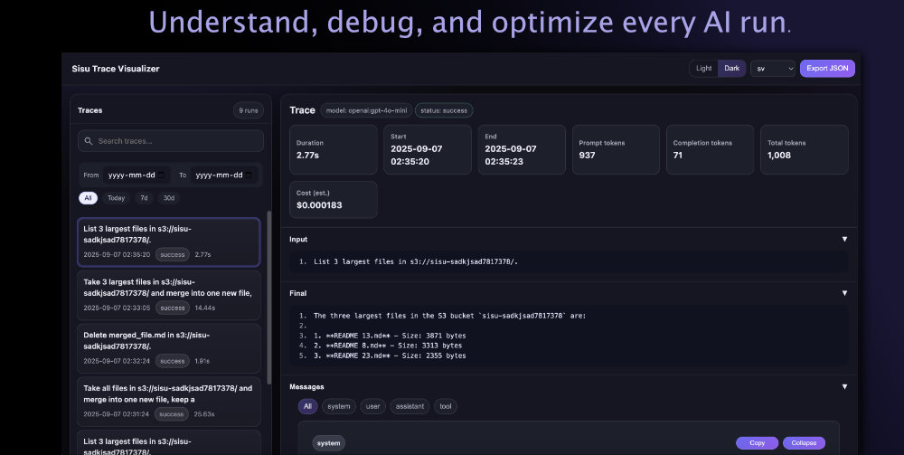
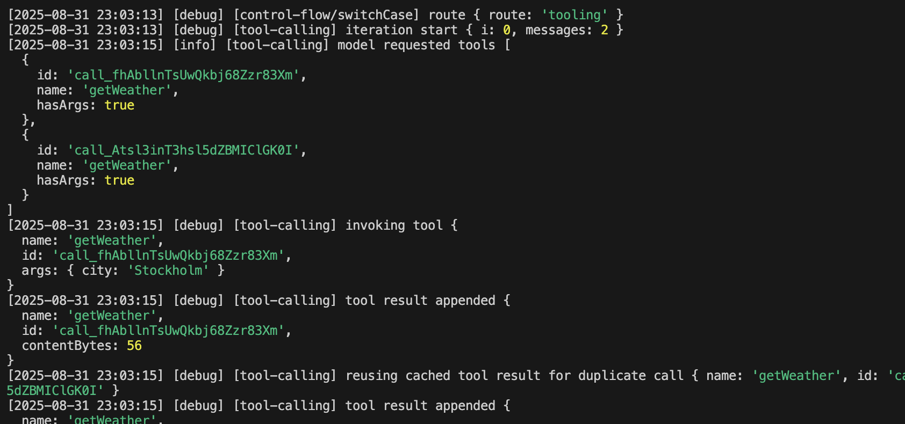
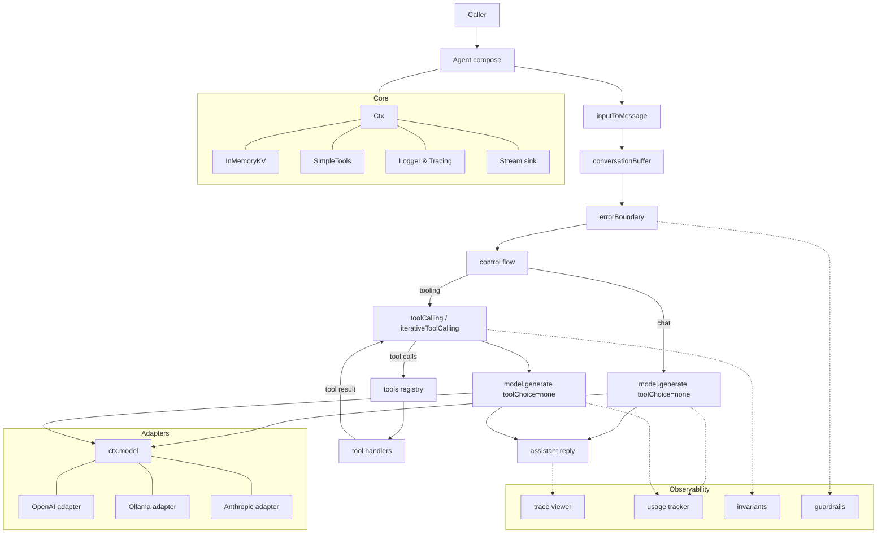

# Build AI agents that just work.

**Sisu** is a TypeScript framework for building reliable AI agents. Inspired by the Finnish concept of _sisu_—calm determination under pressure—it brings predictability, composability, and transparency to AI development.

🎯 **No surprises.** Explicit middleware, typed tools, deterministic control flow.  
🔧 **Full control.** Compose planning, routing, safety like Express apps.  
🔍 **Total visibility.** Built-in tracing, logging, and debugging out of the box.  
🚀 **Provider-agnostic.** OpenAI, Anthropic, Ollama, or bring your own.

[](https://github.com/finger-gun/sisu/actions/workflows/tests.yml)
[](https://github.com/finger-gun/sisu/actions/workflows/github-code-scanning/codeql)
[](https://github.com/finger-gun/sisu/blob/main/LICENSE)
[](https://www.npmjs.com/package/@sisu-ai/core)
[](https://github.com/finger-gun/sisu/blob/main/CONTRIBUTING.md)

---

## Why Developers Choose Sisu

**Tired of black-box AI frameworks?** Sisu gives you full transparency and control.

| Problem                                      | Sisu Solution                                                   |
| -------------------------------------------- | --------------------------------------------------------------- |
| 🤔 "Where did my tokens go?"                 | **Built-in trace viewer** shows every token, cost, and decision |
| 😤 "Why did the tool loop break?"            | **Explicit control flow** you can read, test, and debug         |
| 😓 "Can't swap providers without rewriting"  | **Provider-agnostic adapters** - change 1 line                  |
| 🔒 "Secrets in my logs again?"               | **Automatic redaction** of API keys and sensitive data          |
| 🐛 "Production bugs are impossible to debug" | **Structured logging & HTML traces** for every run              |

---

## ⚡ Quick Start (2 Minutes)

### Install

```bash
# Using pnpm (recommended)
pnpm add @sisu-ai/core @sisu-ai/adapter-openai \
         @sisu-ai/mw-register-tools @sisu-ai/mw-tool-calling \
         @sisu-ai/mw-conversation-buffer @sisu-ai/mw-trace-viewer \
         @sisu-ai/mw-error-boundary zod dotenv

# Or using npm
npm i @sisu-ai/core @sisu-ai/adapter-openai \
      @sisu-ai/mw-register-tools @sisu-ai/mw-tool-calling \
      @sisu-ai/mw-conversation-buffer @sisu-ai/mw-trace-viewer \
      @sisu-ai/mw-error-boundary zod dotenv
```

### Build Your First Agent

```ts
import "dotenv/config";
import { Agent, createCtx, type Tool } from "@sisu-ai/core";
import { registerTools } from "@sisu-ai/mw-register-tools";
import {
  inputToMessage,
  conversationBuffer,
} from "@sisu-ai/mw-conversation-buffer";
import { errorBoundary } from "@sisu-ai/mw-error-boundary";
import { toolCalling } from "@sisu-ai/mw-tool-calling";
import { openAIAdapter } from "@sisu-ai/adapter-openai";
import { traceViewer } from "@sisu-ai/mw-trace-viewer";
import { z } from "zod";

// 1. Define a tool (any async function with a schema)
const weather: Tool<{ city: string }> = {
  name: "getWeather",
  description: "Get weather for a city",
  schema: z.object({ city: z.string() }),
  handler: async ({ city }) => ({ city, tempC: 21, summary: "Sunny" }),
};

// 2. Create your context with model and settings
const ctx = createCtx({
  model: openAIAdapter({ model: "gpt-4o-mini" }),
  input: "What is the weather in Stockholm?",
  systemPrompt: "You are a helpful assistant.",
});

// 3. Build your agent pipeline
const app = new Agent()
  .use(errorBoundary()) // Handle errors gracefully
  .use(traceViewer()) // Auto-generate debug traces
  .use(registerTools([weather])) // Give the agent your tools
  .use(inputToMessage) // Convert input to messages
  .use(conversationBuffer({ window: 8 })) // Manage context window
  .use(toolCalling); // Handle tool loops automatically

// 4. Run it!
await app.handler()(ctx);
console.log(
  "\n✅ Result:",
  ctx.messages.filter((m) => m.role === "assistant").pop()?.content,
);
```

**That's it!** Open `traces/viewer.html` to see exactly what happened.

---

## 🎨 Built-in Observability

### HTML Trace Viewer

**Stop guessing. Start knowing.**



Every run auto-generates an interactive HTML trace showing:

- 💰 **Token usage & costs** per turn
- 🔧 **Tool calls & results** with timing
- 🔍 **Full conversation history** with diffs
- 🐛 **Error details & stack traces** when things break

Perfect for debugging, optimization, and understanding your agent's behavior.

---

### CLI Trace Logs

**Stay in flow with terminal-native logging.**



Structured, color-coded logs that make sense. No more parsing walls of JSON.

---

## 💡 Core Concepts

Sisu is built on **5 simple ideas**:

### 1️⃣ Everything is Middleware

```ts
// Compose your agent like an Express app
const app = new Agent()
  .use(errorBoundary())
  .use(traceViewer())
  .use(registerTools([...]))
  .use(toolCalling);
```

### 2️⃣ One Context, Zero Magic

```ts
// Everything flows through a single typed context
(ctx, next) => {
  ctx.messages.push(...)  // Modify state
  await next()            // Pass to next middleware
  console.log(ctx.result) // React to changes
}
```

### 3️⃣ Typed Tools = Safe Tools

```ts
// Zod schemas validate inputs automatically
const tool: Tool = {
  name: "searchDocs",
  schema: z.object({ query: z.string() }),
  handler: async ({ query }) => {
    /* ... */
  },
};
```

### 4️⃣ Control Flow is Just Code

```ts
import { sequence, branch, loopUntil, parallel, graph } from '@sisu-ai/mw-control-flow';

// Read the plan, no hidden behavior
.use(sequence([
  classifyIntent,
  branch({
    'search': searchPipeline,
    'chat': conversationPipeline
  })
]))
```

### 5️⃣ Provider-Agnostic by Design

```ts
// Swap providers by changing one line
const model = openAIAdapter({ model: "gpt-4o-mini" });
// const model = anthropicAdapter({ model: 'claude-sonnet-4' });
// const model = ollamaAdapter({ model: 'llama3.1' }); // local!
```

---

## 🧠 Skills (Reusable Workflows)

Skills are filesystem-based workflows (SKILL.md) that package domain knowledge and multi-step instructions.

### Quick example

```ts
import { skillsMiddleware } from "@sisu-ai/mw-skills";
import { registerTools } from "@sisu-ai/mw-register-tools";
import { createTerminalTool } from "@sisu-ai/tool-terminal";

const terminal = createTerminalTool({
  roots: [process.cwd()],
  capabilities: { read: true, write: false, delete: false, exec: true },
});

const app = new Agent()
  .use(
    registerTools(terminal.tools, {
      aliases: {
        terminalRun: "bash",
        terminalReadFile: "read_file",
        terminalCd: "cd",
      },
    }),
  )
  .use(
    skillsMiddleware({
      directories: [
        "node_modules/@sisu-ai/skill-code-review",
        "node_modules/@sisu-ai/skill-repo-search",
      ],
    }),
  );
```

Examples:

- `examples/openai-skills`
- `examples/anthropic-skills`

---

## 🏗️ Monorepo Development

Sisu is built with modern tooling for efficient development:

- **🚀 [Turbo](https://turbo.build/)** - Fast, incremental builds with smart caching
- **📦 [pnpm](https://pnpm.io/)** - Efficient package management with workspace support
- **🧪 [Vitest](https://vitest.dev/)** - Lightning-fast testing with coverage
- **📝 [Changesets](https://github.com/changesets/changesets)** - Version management and publishing

### Development Commands

```bash
# Install dependencies
pnpm install

# Build all packages (with caching)
pnpm build

# Run tests with coverage
pnpm test:coverage

# Run specific example
pnpm run ex:openai:hello

# Development workflow
pnpm dev                 # Watch mode for all packages
pnpm lint:fix           # Fix linting issues
pnpm typecheck          # Check TypeScript
```

---

## 🏃 Run Your First Example

**OpenAI Hello World:**

```bash
cp examples/openai-hello/.env.example examples/openai-hello/.env
pnpm run ex:openai:hello
open examples/openai-hello/traces/trace.html  # 👀 See the magic
```

**Local with Ollama (no API key needed!):**

```bash
ollama serve && ollama pull llama3.1
pnpm run ex:ollama:hello
open examples/ollama-hello/traces/trace.html
```

**More examples:** Vision, RAG, Multi-agent, Streaming, and more in [`/examples`](examples/)

---

## 🔧 Key Features

### 🛡️ Production-Ready Safety

- ✅ **Automatic secret redaction** in logs
- ✅ **Error boundaries** with custom handlers
- ✅ **Guardrails middleware** for content filtering
- ✅ **Invariants validation** in development
- ✅ **AbortSignal** support for cancellation

### 🎯 Developer Experience

- ✅ **TypeScript-first** with strict mode
- ✅ **Minimal API surface** - learn once, use everywhere
- ✅ **Composable patterns** - build complex from simple
- ✅ **Zero hidden state** - what you see is what runs
- ✅ **Extensive examples** for every use case

### 🚀 Performance & Flexibility

- ✅ **Streaming support** for real-time responses
- ✅ **Conversation buffering** for long contexts
- ✅ **Context compression** when needed
- ✅ **Parallel tool execution** where safe
- ✅ **RAG & vector search** ready

---

## 📦 Ecosystem

### Adapters

| Provider           | Package                                                      | Tools | Streaming | Vision |
| ------------------ | ------------------------------------------------------------ | :---: | :-------: | :----: |
| **OpenAI**         | [`@sisu-ai/adapter-openai`](packages/adapters/openai/)       |  ✅   |    ✅     |   ✅   |
| **Anthropic**      | [`@sisu-ai/adapter-anthropic`](packages/adapters/anthropic/) |  ✅   |    ✅     |   ❌   |
| **Ollama** (local) | [`@sisu-ai/adapter-ollama`](packages/adapters/ollama/)       |  ✅   |    ✅     |   ✅   |

💡 **Tip:** OpenAI adapter works with **any OpenAI-compatible API** (LM Studio, vLLM, etc.)

### Middleware (Mix & Match)

- 🎯 **Control Flow**: [`sequence`](packages/middleware/control-flow/), [`branch`](packages/middleware/control-flow/), [`parallel`](packages/middleware/control-flow/), [`graph`](packages/middleware/control-flow/)
- 🔧 **Tool Management**: [`registerTools`](packages/middleware/register-tools/), [`toolCalling`](packages/middleware/tool-calling/)
- 💬 **Conversation**: [`conversationBuffer`](packages/middleware/conversation-buffer/), [`contextCompressor`](packages/middleware/context-compressor/)
- 🛡️ **Safety**: [`errorBoundary`](packages/middleware/error-boundary/), [`guardrails`](packages/middleware/guardrails/), [`invariants`](packages/middleware/invariants/)
- 📊 **Observability**: [`traceViewer`](packages/middleware/trace-viewer/), [`usageTracker`](packages/middleware/usage-tracker/)
- 🧠 **Advanced**: [`rag`](packages/middleware/rag/), [`reactParser`](packages/middleware/react-parser/)

### Ready-to-Use Tools

- 🌐 **Web**: [`webFetch`](packages/tools/web-fetch/), [`webSearch`](packages/tools/web-search-google/), [`wikipedia`](packages/tools/wikipedia/)
- ☁️ **Cloud**: [`awsS3`](packages/tools/aws-s3/), [`azureBlob`](packages/tools/azure-blob/)
- 🔧 **DevOps**: [`terminal`](packages/tools/terminal/), [`githubProjects`](packages/tools/github-projects/)
- 🔍 **Data**: [`vectorChroma`](packages/tools/vec-chroma/), [`extractUrls`](packages/tools/extract-urls/), [`summarizeText`](packages/tools/summarize-text/)

[**📚 Full package list →**](#find-your-inner-strength)

---

## 🎓 Learn More

### How It Works

Sisu uses a **Koa-style middleware pipeline** that flows through a single typed context:



**Key flow:**

1. **Middleware pipeline** → Your `Agent` runs a Koa-style chain. Each middleware updates `ctx` and calls `await next()`.
2. **Adapters** → Middleware calls `ctx.model.generate()`. Any provider can implement the contract.
3. **Tools** → The registry holds handlers with Zod schemas. `toolCalling` handles the auto/none loop.
4. **Observability** → Tracing, usage tracking, and guardrails tap the flow transparently.

---

## 🔐 Security & Redaction

**Never log secrets accidentally.**

Sisu automatically detects and redacts:

- 🔑 API keys (OpenAI `sk-...`, Google `AIza...`, AWS `AKIA...`)
- 🎫 Auth tokens (JWT, GitHub PAT, OAuth)
- 🔒 Passwords and secrets in common key names

```ts
import { createRedactingLogger, createConsoleLogger } from "@sisu-ai/core";

const logger = createRedactingLogger(createConsoleLogger());

logger.info({ apiKey: "sk-1234567890abcdef..." });
// Output: { apiKey: '***REDACTED***' }
```

[**🔒 Learn more about security →**](packages/core/README.md#redacting-sensitive-data)

---

## ⚙️ Configuration

### Environment Variables

```bash
# LLM Providers
OPENAI_API_KEY=sk-...
OPENAI_BASE_URL=https://api.openai.com  # Optional override
OLLAMA_BASE_URL=http://localhost:11434
ANTHROPIC_API_KEY=sk-ant-...

# Logging & Debugging
LOG_LEVEL=info  # debug|info|warn|error
DEBUG_LLM=1     # Log adapter requests on errors

# Tracing
TRACE_HTML=1          # Auto-generate HTML traces
TRACE_JSON=1          # Auto-generate JSON traces
TRACE_STYLE=dark      # light|dark
```

### Runtime Configuration

You can configure Sisu examples and scripts in multiple ways:

**1. Inline environment variables (temporary):**

```bash
# Override settings for a single run
MODEL=gpt-4o LOG_LEVEL=debug TRACE_HTML=1 pnpm run ex:openai:hello
```

**2. .env files (persistent):**

```bash
# Copy and edit example .env file
cp examples/openai-hello/.env.example examples/openai-hello/.env
# Edit .env file with your settings, then run:
pnpm run ex:openai:hello
```

**3. Shell environment (session-wide):**

```bash
# Set for current terminal session
export OPENAI_API_KEY=sk-...
export LOG_LEVEL=debug
pnpm run ex:openai:hello
```

---

## 🐛 Debugging Tips

**Problem:** "Where did it break?"  
✅ **Solution:** Set `LOG_LEVEL=debug` and check `traces/run.html`

**Problem:** "What did the LLM actually receive?"  
✅ **Solution:** Set `DEBUG_LLM=1` to see redacted payloads

**Problem:** "Why did the tool loop repeat?"  
✅ **Solution:** Check invariants middleware logs for validation failures

**Problem:** "Production error, no clue why"  
✅ **Solution:** Always use `errorBoundary()` + `traceViewer()` in production

---

## 🤝 Community & Contribution

We're building Sisu in the open and welcome contributions!

- 📖 [**Contributing Guide**](CONTRIBUTING.md) - Start here
- 🐛 [**Report a Bug**](https://github.com/finger-gun/sisu/issues/new?template=bug_report.md)
- 💡 [**Request a Feature**](https://github.com/finger-gun/sisu/issues/new?template=feature_request.md)
- 📜 [**Code of Conduct**](CODE_OF_CONDUCT.md)
- 📄 [**License (Apache 2.0)**](LICENSE)

**Built something cool?** Email [jamie.telin@gmail.com](mailto:jamie.telin@gmail.com) or open a PR!

---

## 📚 Documentation

### Core

- [**Core Package**](packages/core/README.md) - Types, utilities, context
- [**Error Types**](packages/core/ERROR_TYPES.md) - Error handling guide

### Adapters

- [Anthropic](packages/adapters/anthropic/README.md) - Claude models
- [Ollama](packages/adapters/ollama/README.md) - Local inference
- [OpenAI](packages/adapters/openai/README.md) - OpenAI & compatible APIs

### Middleware

<details>
<summary>View all middleware packages →</summary>

- [@sisu-ai/mw-agent-run-api](packages/middleware/agent-run-api/README.md)
- [@sisu-ai/mw-context-compressor](packages/middleware/context-compressor/README.md)
- [@sisu-ai/mw-control-flow](packages/middleware/control-flow/README.md)
- [@sisu-ai/mw-conversation-buffer](packages/middleware/conversation-buffer/README.md)
- [@sisu-ai/mw-cors](packages/middleware/cors/README.md)
- [@sisu-ai/mw-error-boundary](packages/middleware/error-boundary/README.md)
- [@sisu-ai/mw-guardrails](packages/middleware/guardrails/README.md)
- [@sisu-ai/mw-invariants](packages/middleware/invariants/README.md)
- [@sisu-ai/mw-rag](packages/middleware/rag/README.md)
- [@sisu-ai/mw-react-parser](packages/middleware/react-parser/README.md)
- [@sisu-ai/mw-register-tools](packages/middleware/register-tools/README.md)
- [@sisu-ai/mw-tool-calling](packages/middleware/tool-calling/README.md)
- [@sisu-ai/mw-trace-viewer](packages/middleware/trace-viewer/README.md)
- [@sisu-ai/mw-usage-tracker](packages/middleware/usage-tracker/README.md)
</details>

### Tools

<details>
<summary>View all tool packages →</summary>

- [@sisu-ai/tool-aws-s3](packages/tools/aws-s3/README.md)
- [@sisu-ai/tool-azure-blob](packages/tools/azure-blob/README.md)
- [@sisu-ai/tool-extract-urls](packages/tools/extract-urls/README.md)
- [@sisu-ai/tool-github-projects](packages/tools/github-projects/README.md)
- [@sisu-ai/tool-summarize-text](packages/tools/summarize-text/README.md)
- [@sisu-ai/tool-terminal](packages/tools/terminal/README.md)
- [@sisu-ai/tool-vec-chroma](packages/tools/vec-chroma/README.md)
- [@sisu-ai/tool-web-fetch](packages/tools/web-fetch/README.md)
- [@sisu-ai/tool-web-search-duckduckgo](packages/tools/web-search-duckduckgo/README.md)
- [@sisu-ai/tool-web-search-google](packages/tools/web-search-google/README.md)
- [@sisu-ai/tool-web-search-openai](packages/tools/web-search-openai/README.md)
- [@sisu-ai/tool-wikipedia](packages/tools/wikipedia/README.md)
</details>

### Examples

<details>
<summary>View all examples →</summary>

**Anthropic:**

- [anthropic-control-flow](examples/anthropic-control-flow/README.md)
- [anthropic-hello](examples/anthropic-hello/README.md)
- [anthropic-stream](examples/anthropic-stream/README.md)
- [anthropic-weather](examples/anthropic-weather/README.md)

**Ollama (Local):**

- [ollama-hello](examples/ollama-hello/README.md)
- [ollama-stream](examples/ollama-stream/README.md)
- [ollama-vision](examples/ollama-vision/README.md)
- [ollama-weather](examples/ollama-weather/README.md)
- [ollama-web-search](examples/ollama-web-search/README.md)

**OpenAI:**

- [openai-aws-s3](examples/openai-aws-s3/README.md)
- [openai-azure-blob](examples/openai-azure-blob/README.md)
- [openai-branch](examples/openai-branch/README.md)
- [openai-control-flow](examples/openai-control-flow/README.md)
- [openai-error-handling](examples/openai-error-handling/README.md)
- [openai-extract-urls](examples/openai-extract-urls/README.md)
- [openai-github-projects](examples/openai-github-projects/README.md)
- [openai-google-search](examples/openai-google-search)
- [openai-graph](examples/openai-graph/README.md)
- [openai-guardrails](examples/openai-guardrails/README.md)
- [openai-hello](examples/openai-hello/README.md)
- [openai-parallel](examples/openai-parallel/README.md)
- [openai-rag-chroma](examples/openai-rag-chroma/README.md)
- [openai-react](examples/openai-react/README.md)
- [openai-reasoning](examples/openai-reasoning/README.md)
- [openai-search-fetch](examples/openai-search-fetch)
- [openai-server](examples/openai-server/README.md)
- [openai-stream](examples/openai-stream/README.md)
- [openai-terminal](examples/openai-terminal/README.md)
- [openai-vision](examples/openai-vision/README.md)
- [openai-weather](examples/openai-weather/README.md)
- [openai-web-fetch](examples/openai-web-fetch/README.md)
- [openai-web-search](examples/openai-web-search/README.md)
- [openai-wikipedia](examples/openai-wikipedia/README.md)
</details>

---

## Find Your Inner Strength

### Adapters

| Provider      | Package                                                               | Features                                                  | Notes                                    |
| ------------- | --------------------------------------------------------------------- | --------------------------------------------------------- | ---------------------------------------- |
| **OpenAI**    | [`@sisu-ai/adapter-openai`](packages/adapters/openai/README.md)       | ✅ Tools, ✅ JSON mode, ✅ Streaming, ✅ Vision, ✅ Usage | Works with **any** OpenAI-compatible API |
| **Ollama**    | [`@sisu-ai/adapter-ollama`](packages/adapters/ollama/README.md)       | ✅ Local inference, ✅ Tools, ✅ Streaming, ✅ Vision     | Run models locally with `ollama serve`   |
| **Anthropic** | [`@sisu-ai/adapter-anthropic`](packages/adapters/anthropic/README.md) | ✅ Tools, ✅ Streaming, ✅ Usage                          | Claude family models                     |

### When to Reuse vs. Create an Adapter

**Reuse OpenAI adapter if:**

- Provider has OpenAI-compatible API (LM Studio, vLLM, OpenRouter)

```ts
const model = openAIAdapter({
  model: "gpt-4o-mini",
  baseUrl: "http://localhost:1234/v1", // LM Studio
});
```

**Create new adapter if:**

- Different request/response shapes (e.g., Anthropic)
- Special provider features to expose
- Custom metadata or headers

---

## 🚢 Publishing (For Maintainers)

We use [Changesets](https://github.com/changesets/changesets) for versioning.

### Automated Changeset Creation

Use GitHub Copilot prompt files to automate changeset creation:

```bash
# In VS Code, open Copilot Chat and use:
/create-changesets          # Full analysis and changeset creation
/quick-changeset            # Quick analysis for simple changes
/breaking-changes           # Analyze breaking changes specifically
```

Prompt files are located in [`.github/prompts/`](.github/prompts/) and work directly in VS Code.

### Quick Publish

```bash
pnpm run release:publish  # version → publish
```

### Full Workflow

```bash
pnpm run release:full     # changeset → version → publish
```

### Manual Steps

```bash
# 1. Create changeset (or use Copilot automation above)
pnpm run changeset

# 2. Version packages
pnpm run version-packages

# 3. Publish to npm
pnpm run release
```

**Note:** Packages ship `dist/` only with `publishConfig.access = public`

---

## ⭐ Star Us!

If Sisu helps you build better AI agents, give us a star on GitHub! It helps others discover the project.

**[⭐ Star on GitHub →](https://github.com/finger-gun/sisu)**

---

<div align="center">

**Built with ❤️ and sisu.**

_Quiet, determined, relentlessly useful._

</div>
