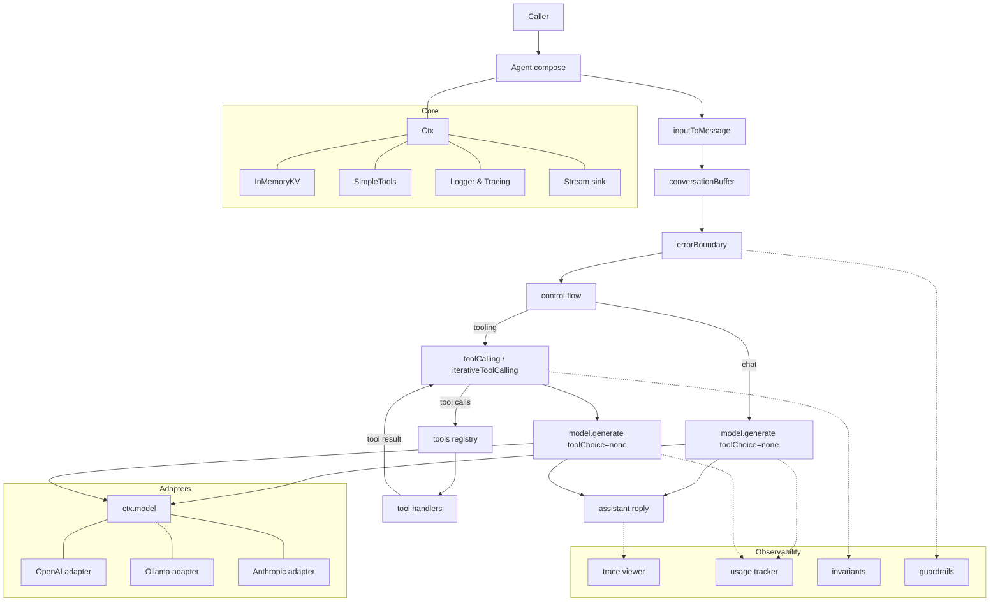

> Grit‑powered agents. Quiet, determined, relentlessly useful.

**Sisu** is a lightweight TypeScript framework for turning intent into action. Inspired by the Finnish idea of sisu—calm resolve under pressure—Sisu favors explicit tools, predictable plans, and built‑in guardrails. No ceremony, no mystery: compose, decide, do.

[](https://github.com/finger-gun/sisu/actions/workflows/tests.yml)
[](https://github.com/finger-gun/sisu/actions/workflows/github-code-scanning/codeql)
[](https://github.com/finger-gun/sisu/blob/main/LICENSE)
[](https://www.npmjs.com/package/@sisu-ai/core)
[](https://github.com/finger-gun/sisu/blob/main/CONTRIBUTING.md)

## Why Sisu?
- Everything is middleware: compose planning, tools, routing, safety like you compose Express/Koa apps.
- One ctx, zero magic: a single typed context flows through; what you see is what runs.
- Typed tools, explicit loops: tool calls and control flow are first‑class and deterministic.
- Provider‑agnostic, adapter‑friendly: OpenAI, Anthropic, Ollama (local), or your own HTTP client.
- Built‑in observability: structured logs, redaction, and an HTML trace viewer per run.


### Trace Viewer

**Understand, debug, and optimize every AI run.**

Sisu Trace Viewer gives you full visibility into your AI workflows — from token usage and costs, to tool calls and debugging details.

✅ **Track performance with precision** – see exactly how tokens and costs are spent.   
✅ **Debug with confidence** – inspect tool calls and spot issues instantly.   
✅ **Search & filter across traces** – find the run you need, faster.   
✅ **Iterate at lightning speed** – optimize workflows and shorten feedback loops.   

Whether you’re building prototypes or scaling production systems, Sisu Trace Viewer makes AI development **transparent, efficient, and reliable.**

---


### CLI Trace Logs
Stay in flow with structured, color-coded logs right in your terminal. Perfect for rapid iteration and debugging.


## 90‑Second Example
Turn intent into action with a clear, inspectable pipeline.

**Install the packages used below:**
```bash
npm i \
  @sisu-ai/core @sisu-ai/adapter-openai \
  @sisu-ai/mw-register-tools @sisu-ai/mw-conversation-buffer \
  @sisu-ai/mw-tool-calling \
  @sisu-ai/mw-trace-viewer @sisu-ai/mw-error-boundary \
  zod dotenv
```

**Write something awesome with code:**

```ts
import 'dotenv/config';
import { Agent, createConsoleLogger, InMemoryKV, NullStream, SimpleTools, type Tool, type Ctx } from '@sisu-ai/core';
import { registerTools } from '@sisu-ai/mw-register-tools';
import { inputToMessage, conversationBuffer } from '@sisu-ai/mw-conversation-buffer';
import { errorBoundary } from '@sisu-ai/mw-error-boundary';
import { toolCalling /* or iterativeToolCalling */ } from '@sisu-ai/mw-tool-calling';
import { openAIAdapter } from '@sisu-ai/adapter-openai';
import { traceViewer } from '@sisu-ai/mw-trace-viewer';
import { z } from 'zod';

// Tool
interface WeatherArgs { city: string }
const weather: Tool<WeatherArgs> = {
  name: 'getWeather',
  description: 'Get weather for a city',
  schema: z.object({ city: z.string() }),
  handler: async ({ city }) => ({ city, tempC: 21, summary: 'Sunny' }),
};

// Model
const model = openAIAdapter({ model: 'openai/gpt-oss-20b', baseUrl: 'http://127.0.0.1:1234/' });

// Ctx
const ctx: Ctx = {
  input: process.argv.slice(2).join(' ') || 'What is the weather in Malmö?',
  messages: [{ role: 'system', content: 'You are a helpful assistant.' }],
  model,
  tools: new SimpleTools(),
  memory: new InMemoryKV(),
  stream: new NullStream(),
  state: {},
  signal: new AbortController().signal,
  log: createConsoleLogger(),
};

// Minimal pipeline: no classifier, no switch, no manual loop
const app = new Agent()
  .use(errorBoundary(async (err, c) => {
    c.log.error(err);
    c.messages.push({ role: 'assistant', content: 'Sorry, something went wrong.' });
  }))
  .use(traceViewer())
  .use(registerTools([weather]))
  .use(inputToMessage)
  .use(conversationBuffer({ window: 8 }))
  .use(toolCalling); // 1) generate(..., auto) → maybe run tools → 2) finalize with none

await app.handler()(ctx);
const final = ctx.messages.filter(m => m.role === 'assistant').pop();
console.log('\nAssistant:\n', final?.content);
```

## Core Ideas
- Koa‑style middleware: `(ctx, next) => { …; await next(); … }` gives “onion” control—before/after work is explicit and composable.
- Single ctx: no hidden globals. Everything lives on `ctx` so it’s easy to reason about and test.
- Typed tools: tool schemas inform tool loops and protect your handlers.
- Control flow is code: `sequence`, `branch`, `switchCase`, `loopUntil`, `parallel`, `graph`—you read the plan in the code.
- Deterministic modes: timeouts, bounded loops, retries are explicit—in your hands.
- Observability by default: leveled logs, redaction, and a trace viewer that writes `traces/run-*.html`.

## How it works
This is a typical use case flow. However, as SIsu is very flexible by nature, it can vary. But this is the core idea.



* **Middleware pipeline**: your `Agent` runs a Koa-style chain (`ctx`, `next`). Each middleware reads or updates `ctx` and calls `await next()` unless it short-circuits. Core stays tiny; everything else is opt-in middleware.
* **Adapters**: middleware like `toolCalling` and control-flow ultimately call `ctx.model.generate(...)`. The model is provided by an adapter (e.g. OpenAI, Ollama or Anthropic), but any provider can implement the `LLM.generate` contract.
* **Tools**: the tools registry holds named handlers with zod schemas. `toolCalling` does a first turn with `toolChoice auto`, runs each unique tool pick, then a final completion with `toolChoice none`. `iterativeToolCalling` repeats the “auto” turn until no more tool calls.
* **Core services**: `Ctx` carries messages, tools, memory, logger, stream, state; `InMemoryKV` and `SimpleTools` are minimal defaults.
* **Observability**: tracing, usage, invariants, guardrails are middlewares that tap the flow without changing behavior.


## Run your first mile
- OpenAI hello:
  - `cp examples/openai-hello/.env.example examples/openai-hello/.env`
  - `npm run ex:openai:hello`
  - Open `examples/openai-hello/traces/trace.html`
- Ollama hello (local):
  - `ollama serve && ollama pull llama3.1:latest`
  - `npm run ex:ollama:hello`
  - Open `examples/ollama-hello/traces/trace.html`

- OpenAI vision:
  - `cp examples/openai-vision/.env.example examples/openai-vision/.env`
  - `npm run ex:openai:vision`
  - Open `examples/openai-vision/traces/trace.html`

- Ollama vision (local):
  - `ollama serve && ollama pull llava:latest` (or another vision-capable model)
  - `npm run ex:ollama:vision`
  - Open `examples/ollama-vision/traces/trace.html`
  - The Ollama adapter auto-fetches http(s) image URLs and inlines them as base64.


## Find your inner strength
- [packages/core](packages/core/README.md)
- Adapters: [Anthropic](packages/adapters/anthropic/README.md), [Ollama](packages/adapters/ollama/README.md), [OpenAI](packages/adapters/openai/README.md)
- Middlewares:
  - [@sisu-ai/mw-agent-run-api](packages/middleware/agent-run-api/README.md)
  - [@sisu-ai/mw-context-compressor](packages/middleware/context-compressor/README.md)
  - [@sisu-ai/mw-control-flow](packages/middleware/control-flow/README.md)
  - [@sisu-ai/mw-conversation-buffer](packages/middleware/conversation-buffer/README.md)
  - [@sisu-ai/mw-cors](packages/middleware/cors/README.md)
  - [@sisu-ai/mw-error-boundary](packages/middleware/error-boundary/README.md)
  - [@sisu-ai/mw-guardrails](packages/middleware/guardrails/README.md)
  - [@sisu-ai/mw-invariants](packages/middleware/invariants/README.md)
  - [@sisu-ai/mw-rag](packages/middleware/rag/README.md)
  - [@sisu-ai/mw-react-parser](packages/middleware/react-parser/README.md)
  - [@sisu-ai/mw-register-tools](packages/middleware/register-tools/README.md)
  - [@sisu-ai/mw-tool-calling](packages/middleware/tool-calling/README.md)
  - [@sisu-ai/mw-trace-viewer](packages/middleware/trace-viewer/README.md)
  - [@sisu-ai/mw-usage-tracker](packages/middleware/usage-tracker/README.md)
- Tools:
  - [@sisu-ai/tool-aws-s3](packages/tools/aws-s3/README.md)
  - [@sisu-ai/tool-azure-blob](packages/tools/azure-blob/README.md)
  - [@sisu-ai/tool-extract-urls](packages/tools/extract-urls/README.md)
  - [@sisu-ai/tool-github-projects](packages/tools/github-projects/README.md)
  - [@sisu-ai/tool-summarize-text](packages/tools/summarize-text/README.md)
  - [@sisu-ai/tool-terminal](packages/tools/terminal/README.md)
  - [@sisu-ai/tool-vec-chroma](packages/tools/vec-chroma/README.md)
  - [@sisu-ai/tool-web-fetch](packages/tools/web-fetch/README.md)
  - [@sisu-ai/tool-web-search-duckduckgo](packages/tools/web-search-duckduckgo/README.md)
  - [@sisu-ai/tool-web-search-google](packages/tools/web-search-google/README.md)
  - [@sisu-ai/tool-web-search-openai](packages/tools/web-search-openai/README.md)
  - [@sisu-ai/tool-wikipedia](packages/tools/wikipedia/README.md)
- Examples:
  - [anthropic-control-flow](examples/anthropic-control-flow/README.md)
  - [anthropic-hello](examples/anthropic-hello/README.md)
  - [anthropic-stream](examples/anthropic-stream/README.md)
  - [anthropic-weather](examples/anthropic-weather/README.md)
  - [ollama-hello](examples/ollama-hello/README.md)
  - [ollama-stream](examples/ollama-stream/README.md)
  - [ollama-weather](examples/ollama-weather/README.md)
  - [ollama-web-search](examples/ollama-web-search/README.md)
  - [openai-aws-s3](examples/openai-aws-s3/README.md)
  - [openai-azure-blob](examples/openai-azure-blob/README.md)
  - [openai-branch](examples/openai-branch/README.md)
  - [openai-control-flow](examples/openai-control-flow/README.md)
  - [openai-extract-urls](examples/openai-extract-urls/README.md)
  - [openai-github-projects](examples/openai-github-projects/README.md)
  - [openai-google-search](examples/openai-google-search)
  - [openai-graph](examples/openai-graph/README.md)
  - [openai-guardrails](examples/openai-guardrails/README.md)
  - [openai-hello](examples/openai-hello/README.md)
  - [openai-parallel](examples/openai-parallel/README.md)
  - [openai-rag-chroma](examples/openai-rag-chroma/README.md)
  - [openai-react](examples/openai-react/README.md)
  - [openai-search-fetch](examples/openai-search-fetch)
  - [openai-server](examples/openai-server/README.md)
  - [openai-stream](examples/openai-stream/README.md)
  - [openai-terminal](examples/openai-terminal/README.md)
  - [openai-vision](examples/openai-vision/README.md)
  - [openai-weather](examples/openai-weather/README.md)
  - [openai-web-fetch](examples/openai-web-fetch/README.md)
  - [openai-web-search](examples/openai-web-search/README.md)
  - [openai-wikipedia](examples/openai-wikipedia/README.md)
---

# Adapters

Adapters are small shims that let Sisu talk to different LLM providers in a **normalized way**.
Every adapter implements the same `LLM.generate(messages, opts)` contract so you can swap providers without changing your agent code.

| Adapter       | Package                      | Features                                                                               | Notes                                                                                                                         |
|---------------|------------------------------|----------------------------------------------------------------------------------------|-------------------------------------------------------------------------------------------------------------------------------|
| **OpenAI**    | `@sisu-ai/adapter-openai`    | ✅ Tool calling, ✅ JSON mode, ✅ Streaming, ✅ Vision (multi-part input), ✅ Usage reporting | Works with OpenAI API and *any service that is OpenAI-compatible* (e.g. **LM Studio**, **vLLM**, some **OpenRouter** models). |
| **Ollama**    | `@sisu-ai/adapter-ollama`    | ✅ Local inference, ✅ Tool calling, ✅ Streaming, ✅ Vision (multi-part input)                                   | Run local models via [`ollama serve`](https://ollama.com).                                                                    |
| **Anthropic** | `@sisu-ai/adapter-anthropic` | ✅ Tool calling, ✅ Streaming, ✅ Usage reporting                                         | Claude family models. Slightly different tool-call semantics are normalized for you.                                          |

### When to re-use vs. add a new adapter

* If a provider exposes an **OpenAI-compatible API** (LM Studio, vLLM server, some OpenRouter models), you can just use the **OpenAI adapter** with a custom `baseUrl`.

  ```ts
  import { openAIAdapter } from '@sisu-ai/adapter-openai';

  const model = openAIAdapter({
    model: 'gpt-4o-mini',
    baseUrl: 'http://localhost:1234/v1', // e.g. LM Studio
  });
  ```
* A **dedicated adapter** is only needed when a provider:

  * has **different request/response shapes** (e.g. Anthropic),
  * exposes **extra metadata or headers** (usage, rate-limits),
  * or supports **special features** you want to surface in `GenerateOptions`.

## OpenAI

```ts
import { openAIAdapter } from '@sisu-ai/adapter-openai';
const model = openAIAdapter({ model: 'gpt-4o-mini' });
// ctx.model = model
```

| Feature       | Details                                                                                                                                                    |
|---------------|------------------------------------------------------------------------------------------------------------------------------------------------------------|
| **Env Vars**  | - `OPENAI_API_KEY` or `API_KEY`<br>- `OPENAI_BASE_URL` or `BASE_URL`                                                                                       |
| **Tools**     | ✅                                                                                                                                                          |
| **Images**    | - Multi-part arrays: `{ type: 'text' \| 'image_url' }`<br>- Example: `[{ type: 'text', ...}, { type: 'image_url', ...}]`<br>- See `examples/openai-vision` |
| **Streaming** | ✅                                                                                                                                                          |

---

## Ollama (local)

```ts
import { ollamaAdapter } from '@sisu-ai/adapter-ollama';
const model = ollamaAdapter({ model: 'llama3.1' });
// ctx.model = model
```

| Feature       | Details                                                              |
|---------------|----------------------------------------------------------------------|
| **Env Vars**  | - `OLLAMA_BASE_URL` or `BASE_URL` (default `http://localhost:11434`) |
| **Tools**     | ✅                                                                    |
| **Images**    | - Multi-part arrays: `{ type: 'text' \| 'image_url' }`<br>- Example: `[{ type: 'text', ...}, { type: 'image_url', ...}]`<br>- See `examples/ollama-vision` |
| **Streaming** | ✅                                                                    |

---

## Anthropic

```ts
import { anthropicAdapter } from '@sisu-ai/adapter-anthropic';
const model = anthropicAdapter({ model: 'claude-sonnet-4-20250514' });
// ctx.model = model
```

| Feature       | Details                                                                    |
|---------------|----------------------------------------------------------------------------|
| **Env Vars**  | - `ANTHROPIC_API_KEY` or `API_KEY`<br>- `ANTHROPIC_BASE_URL` or `BASE_URL` |
| **Tools**     | ✅                                                                          |
| **Images**    | –                                                                          |
| **Streaming** | ✅                                                                          |

---


## Configuration (Env & Flags)
- Env vars (adapters)
  - `OPENAI_API_KEY` or `API_KEY`: API key for OpenAI/gateway
  - `OPENAI_BASE_URL` or `BASE_URL`: override base URL for OpenAI adapter
  - `OLLAMA_BASE_URL` or `BASE_URL`: override base URL for Ollama adapter
- Env vars (OpenAI Responses tool)
  - `OPENAI_RESPONSES_BASE_URL`: specific base URL for the Responses API (defaults to `https://api.openai.com`)
  - `OPENAI_RESPONSES_MODEL`: model for Responses (defaults to `gpt-4.1-mini`)
- Env vars (runtime)
  - `LOG_LEVEL`: `debug|info|warn|error` (default `info`)
  - `DEBUG_LLM`: `1|true` to log adapter request/response summaries on errors
- Trace viewer flags
  - CLI: `--trace` (optional `--trace=run.json|run.html`), `--trace-style=light|dark`
  - Env: `TRACE_JSON=1`, `TRACE_HTML=1`, `TRACE_STYLE=light|dark`
- Notes
  - Precedence in examples: CLI flags > env vars. At library level, adapter options in code override env.
  - Adapters accept `baseUrl` in code; env overrides are convenient for examples and scripts.
  - Examples accept a trailing prompt string; use quotes to preserve spaces.

### CLI helpers (core)
- `parseFlags(argv)`: Parses `--k=v`, `--k v`, and boolean flags into a map.
- `firstConfigValue([ENV1, ENV2], flags, env)`: Returns the first defined value by checking CLI flags (kebab-case of env var names) before environment variables.
- Convention: Any env var `FOO_BAR` can be provided as CLI flag `--foo-bar`.

## Debugging Tips
- Set `LOG_LEVEL=debug` to see control‑flow, tool loop, and invariant logs.
- Set `DEBUG_LLM=1` to log redacted HTTP payloads from the OpenAI adapter when a call fails (status + body snippet).
- The trace viewer writes `run.json` and `run.html` for quick scanning of messages and events.

# Community & Support
- [Code of Conduct](https://github.com/finger-gun/sisu/blob/main/CODE_OF_CONDUCT.md)
- [Contributing Guide](https://github.com/finger-gun/sisu/blob/main/CONTRIBUTING.md)
- [License](https://github.com/finger-gun/sisu/blob/main/LICENSE)
- [Report a Bug](https://github.com/finger-gun/sisu/issues/new?template=bug_report.md)
- [Request a Feature](https://github.com/finger-gun/sisu/issues/new?template=feature_request.md)

# Developers
You are free to help out. Built an awesome middleware? Found a bug? Lets go! Send me an email, [jamie.telin@gmail.com](mailto:jamie.telin@gmail.com), or contact me on some socials.

## Publishing
We use Changesets to manage versioning and releases for each package.

Prereqs
- Ensure you are logged in to npm: `npm whoami` (or `npm login`)
- Have publish rights for the `@sisu-ai/*` scopes and 2FA if required

Flow
1) Create a changeset for your changes
```bash
npm run changeset
# pick packages, write a summary
git add . && git commit -m "chore: changeset"
```
2) Version the packages (applies the changesets)
```bash
npm run version-packages
git add . && git commit -m "chore: version packages"
git push
```
3) Publish to npm
```bash
npm run release
# If 2FA enabled, enter OTP when prompted
```

Notes
- Packages are configured with `publishConfig.access = public` and ship `dist/` only.
- `.changeset/config.json` ignores `examples/*` when computing releases.
- CI can run `npm run release` on the `main` branch if desired; Changesets supports automated publishing.
