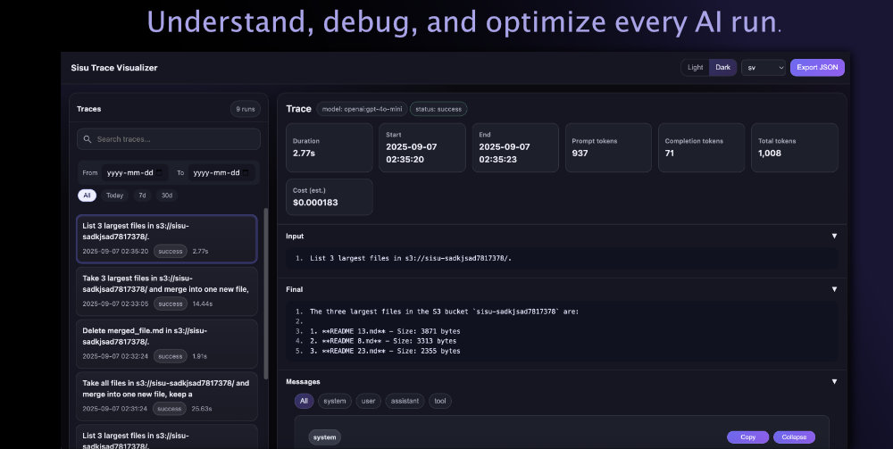
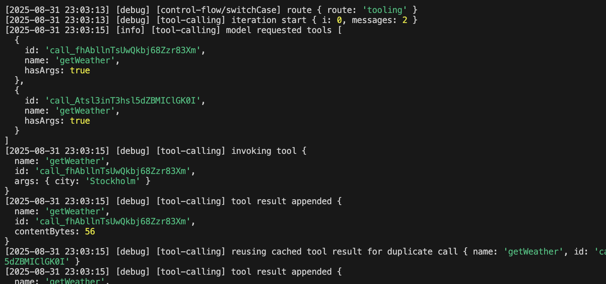

<div align="center">

<p>

</p>

<h4>A TypeScript framework for reliable AI agents with full transparency and control.
Inspired by the Finnish concept of <i>sisu</i> calm determination under pressure.</h4>

# Build AI agents that just work.

**No surprises.** Explicit middleware, typed tools, deterministic control flow.
**Full control.** Compose planning, routing, and safety like Express apps.
**Total visibility.** Built-in tracing, logging, and debugging out of the box.
**Provider-agnostic.** OpenAI, Anthropic, Ollama, or bring your own.

[](https://github.com/finger-gun/sisu/actions/workflows/tests.yml)
[](https://github.com/finger-gun/sisu/actions/workflows/github-code-scanning/codeql)
[](https://github.com/finger-gun/sisu/blob/main/LICENSE)
[](https://www.npmjs.com/package/@sisu-ai/core)
[](https://github.com/finger-gun/sisu/blob/main/CONTRIBUTING.md)

</div>

---

## Quick Start

### Install

```bash
pnpm add @sisu-ai/core @sisu-ai/adapter-openai \
         @sisu-ai/mw-register-tools @sisu-ai/mw-tool-calling \
         @sisu-ai/mw-conversation-buffer @sisu-ai/mw-trace-viewer \
         @sisu-ai/mw-error-boundary zod dotenv
```

### Your First Agent

```ts
import "dotenv/config";
import { Agent, createCtx, type Tool } from "@sisu-ai/core";
import { registerTools } from "@sisu-ai/mw-register-tools";
import { inputToMessage, conversationBuffer } from "@sisu-ai/mw-conversation-buffer";
import { errorBoundary } from "@sisu-ai/mw-error-boundary";
import { toolCalling } from "@sisu-ai/mw-tool-calling";
import { openAIAdapter } from "@sisu-ai/adapter-openai";
import { traceViewer } from "@sisu-ai/mw-trace-viewer";
import { z } from "zod";

const weather: Tool<{ city: string }> = {
  name: "getWeather",
  description: "Get weather for a city",
  schema: z.object({ city: z.string() }),
  handler: async ({ city }) => ({ city, tempC: 21, summary: "Sunny" }),
};

const ctx = createCtx({
  model: openAIAdapter({ model: "gpt-4o-mini" }),
  input: "What is the weather in Stockholm?",
  systemPrompt: "You are a helpful assistant.",
});

const app = new Agent()
  .use(errorBoundary())
  .use(traceViewer())
  .use(registerTools([weather]))
  .use(inputToMessage)
  .use(conversationBuffer({ window: 8 }))
  .use(toolCalling);

await app.handler()(ctx);
```

Open `traces/viewer.html` to see exactly what happened.

---

## Why Sisu

| You're dealing with...                    | Sisu gives you...                                      |
| ----------------------------------------- | ------------------------------------------------------ |
| "Where did my tokens go?"                 | A trace viewer showing every token, cost, and decision |
| "The tool loop broke and I can't debug it" | Explicit control flow you can read, test, and step through |
| "Can't swap providers without rewriting"  | Provider-agnostic adapters — change one line           |
| "Secrets keep leaking into my logs"       | Automatic redaction of API keys and sensitive data     |
| "Production bugs are impossible to trace" | Structured logging and HTML traces for every run       |

---

## Built-in Observability

### HTML Trace Viewer



Every run auto-generates an interactive HTML trace: token usage and costs, tool calls with timing, full conversation history, and error details when things break.

### CLI Trace Logs



Structured, color-coded terminal output. No more parsing walls of JSON.

---

## Core Concepts

### Everything is Middleware

Compose your agent pipeline like an Express app. Each middleware does one thing well.

```ts
const app = new Agent()
  .use(errorBoundary())
  .use(traceViewer())
  .use(registerTools([...]))
  .use(toolCalling);
```

### One Context, Zero Magic

Everything flows through a single typed `ctx`. No hidden state, no side channels.

```ts
(ctx, next) => {
  ctx.messages.push(...)  // Modify state
  await next()            // Pass to next middleware
  console.log(ctx.result) // React to changes
}
```

### Typed Tools

Zod schemas validate tool inputs automatically. Define once, use safely everywhere.

```ts
const tool: Tool = {
  name: "searchDocs",
  schema: z.object({ query: z.string() }),
  handler: async ({ query }) => { /* ... */ },
};
```

### Control Flow is Just Code

Sequence, branch, loop, run in parallel, or define a DAG. Readable, testable, no hidden behavior.

```ts
import { sequence, branch, parallel, graph } from '@sisu-ai/mw-control-flow';

.use(sequence([
  classifyIntent,
  branch({
    'search': searchPipeline,
    'chat': conversationPipeline
  })
]))
```

### Swap Providers in One Line

```ts
const model = openAIAdapter({ model: "gpt-4o-mini" });
// const model = anthropicAdapter({ model: 'claude-sonnet-4' });
// const model = ollamaAdapter({ model: 'llama3.1' });
```

The OpenAI adapter works with any compatible API (LM Studio, vLLM, OpenRouter):

```ts
const model = openAIAdapter({
  model: "gpt-4o-mini",
  baseUrl: "http://localhost:1234/v1",
});
```

---

## Ecosystem

### Adapters

| Provider    | Package                                                              | Tools | Streaming | Vision |
| ----------- | -------------------------------------------------------------------- | :---: | :-------: | :----: |
| OpenAI      | [`@sisu-ai/adapter-openai`](packages/adapters/openai/README.md)      |   ✓   |     ✓     |    ✓   |
| Anthropic   | [`@sisu-ai/adapter-anthropic`](packages/adapters/anthropic/README.md) |   ✓   |     ✓     |    ✓   |
| Ollama      | [`@sisu-ai/adapter-ollama`](packages/adapters/ollama/README.md)       |   ✓   |     ✓     |    ✓   |

### Middleware

| Category       | Packages |
| -------------- | -------- |
| Control Flow   | [`sequence`](packages/middleware/control-flow/) · [`branch`](packages/middleware/control-flow/) · [`parallel`](packages/middleware/control-flow/) · [`graph`](packages/middleware/control-flow/) |
| Tool Management | [`registerTools`](packages/middleware/register-tools/) · [`toolCalling`](packages/middleware/tool-calling/) |
| Conversation   | [`conversationBuffer`](packages/middleware/conversation-buffer/) · [`contextCompressor`](packages/middleware/context-compressor/) |
| Safety         | [`errorBoundary`](packages/middleware/error-boundary/) · [`guardrails`](packages/middleware/guardrails/) · [`invariants`](packages/middleware/invariants/) |
| Observability  | [`traceViewer`](packages/middleware/trace-viewer/) · [`usageTracker`](packages/middleware/usage-tracker/) |
| Advanced       | [`rag`](packages/middleware/rag/) · [`reactParser`](packages/middleware/react-parser/) · [`skills`](packages/middleware/skills/) · [`orchestration`](packages/middleware/orchestration/) |

### Tools

| Category | Packages |
| -------- | -------- |
| Web      | [`webFetch`](packages/tools/web-fetch/) · [`webSearch`](packages/tools/web-search-google/) · [`wikipedia`](packages/tools/wikipedia/) |
| Cloud    | [`awsS3`](packages/tools/aws-s3/) · [`azureBlob`](packages/tools/azure-blob/) |
| Dev      | [`terminal`](packages/tools/terminal/) · [`githubProjects`](packages/tools/github-projects/) |
| Data     | [`ragTools`](packages/tools/rag/) · [`extractUrls`](packages/tools/extract-urls/) · [`summarizeText`](packages/tools/summarize-text/) |

### Libraries

| Category | Packages |
| -------- | -------- |
| RAG & Vector | [`ragCore`](packages/rag/core/) · [`vectorCore`](packages/vector/core/) · [`vectorChromaAdapter`](packages/vector/chroma/) · [`vectorVectraAdapter`](packages/vector/vectra/) |

### RAG Stack

Sisu keeps RAG split into small layers:

- [`@sisu-ai/vector-core`](packages/vector/core/README.md) defines the `VectorStore` contract
- [`@sisu-ai/vector-chroma`](packages/vector/chroma/README.md) implements that contract for Chroma
- [`@sisu-ai/vector-vectra`](packages/vector/vectra/README.md) implements that contract for local file-backed Vectra indexes
- [`@sisu-ai/rag-core`](packages/rag/core/README.md) handles chunking, record prep, and direct store/retrieve helpers
- [`@sisu-ai/tool-rag`](packages/tools/rag/README.md) exposes model-facing retrieval/storage tools
- [`@sisu-ai/mw-rag`](packages/middleware/rag/README.md) supports deterministic middleware-driven RAG flows

That keeps backend code, reusable mechanics, tool-calling, and middleware composition separate.

---

## Run an Example

```bash
# OpenAI
cp examples/openai-hello/.env.example examples/openai-hello/.env
pnpm run ex:openai:hello
open examples/openai-hello/traces/trace.html

# OpenAI orchestration
pnpm run ex:openai:orchestration
pnpm run ex:openai:orchestration-adaptive

# Ollama (local, no API key needed)
ollama serve && ollama pull llama3.1
pnpm run ex:ollama:hello

# Desktop macOS app (starts local runtime + SwiftUI app)
pnpm run ex:desktop:macos
```

25+ examples covering streaming, vision, RAG, control flow, orchestration, guardrails, and more in [`/examples`](examples/).

Agent skill users can install the Sisu reference bundle with:

```bash
npx @sisu-ai/skill-install
```

Framework users can also inspect maintained packages and scaffold starters with:

```bash
npx @sisu-ai/cli list tools
npx @sisu-ai/cli info mw-rag
npx @sisu-ai/cli create chat-agent my-app
npx @sisu-ai/cli install skill
```

---

## Configuration

```bash
# LLM Providers
API_KEY=sk-...
BASE_URL=http://localhost:11434           # optional, when overriding provider defaults
MODEL=gpt-4o-mini                         # optional, example/provider dependent

# Logging
LOG_LEVEL=info        # debug | info | warn | error
DEBUG_LLM=1           # log adapter requests on errors

# Tracing
TRACE_HTML=1           # auto-generate HTML traces
TRACE_JSON=1           # auto-generate JSON traces
TRACE_STYLE=dark       # light | dark
```

---

## Development

```bash
pnpm install           # install dependencies
pnpm build             # build all packages (Turbo-cached)
pnpm test              # run all tests
pnpm test:coverage     # run with coverage (target ≥80%)
pnpm dev               # watch mode
pnpm lint:fix          # fix lint issues
pnpm typecheck         # type check all packages
```

Built with [Turbo](https://turbo.build/), [pnpm workspaces](https://pnpm.io/), [Vitest](https://vitest.dev/), and [Changesets](https://github.com/changesets/changesets).

---

## Documentation

**Core** — [Package docs](packages/core/README.md) · [Error types](packages/core/ERROR_TYPES.md)

**Adapters** — [OpenAI](packages/adapters/openai/README.md) · [Anthropic](packages/adapters/anthropic/README.md) · [Ollama](packages/adapters/ollama/README.md)

<details>
<summary>All middleware packages</summary>

- [@sisu-ai/mw-agent-run-api](packages/middleware/agent-run-api/README.md)
- [@sisu-ai/mw-context-compressor](packages/middleware/context-compressor/README.md)
- [@sisu-ai/mw-control-flow](packages/middleware/control-flow/README.md)
- [@sisu-ai/mw-conversation-buffer](packages/middleware/conversation-buffer/README.md)
- [@sisu-ai/mw-cors](packages/middleware/cors/README.md)
- [@sisu-ai/mw-error-boundary](packages/middleware/error-boundary/README.md)
- [@sisu-ai/mw-guardrails](packages/middleware/guardrails/README.md)
- [@sisu-ai/mw-invariants](packages/middleware/invariants/README.md)
- [@sisu-ai/mw-orchestration](packages/middleware/orchestration/README.md)
- [@sisu-ai/mw-rag](packages/middleware/rag/README.md)
- [@sisu-ai/mw-react-parser](packages/middleware/react-parser/README.md)
- [@sisu-ai/mw-register-tools](packages/middleware/register-tools/README.md)
- [@sisu-ai/mw-tool-calling](packages/middleware/tool-calling/README.md)
- [@sisu-ai/mw-trace-viewer](packages/middleware/trace-viewer/README.md)
- [@sisu-ai/mw-usage-tracker](packages/middleware/usage-tracker/README.md)
</details>

<details>
<summary>All tool packages</summary>

- [@sisu-ai/tool-aws-s3](packages/tools/aws-s3/README.md)
- [@sisu-ai/tool-azure-blob](packages/tools/azure-blob/README.md)
- [@sisu-ai/tool-extract-urls](packages/tools/extract-urls/README.md)
- [@sisu-ai/tool-github-projects](packages/tools/github-projects/README.md)
- [@sisu-ai/tool-rag](packages/tools/rag/README.md)
- [@sisu-ai/tool-summarize-text](packages/tools/summarize-text/README.md)
- [@sisu-ai/tool-terminal](packages/tools/terminal/README.md)
- [@sisu-ai/tool-web-fetch](packages/tools/web-fetch/README.md)
- [@sisu-ai/tool-web-search-duckduckgo](packages/tools/web-search-duckduckgo/README.md)
- [@sisu-ai/tool-web-search-google](packages/tools/web-search-google/README.md)
- [@sisu-ai/tool-web-search-linkup](packages/tools/web-search-linkup/README.md)
- [@sisu-ai/tool-web-search-openai](packages/tools/web-search-openai/README.md)
- [@sisu-ai/tool-wikipedia](packages/tools/wikipedia/README.md)
</details>

<details>
<summary>RAG packages</summary>

- [@sisu-ai/rag-core](packages/rag/core/README.md)
</details>

<details>
<summary>All skill packages</summary>

- [@sisu-ai/skill-code-review](packages/skills/skill-code-review/README.md)
- [@sisu-ai/skill-debug](packages/skills/skill-debug/README.md)
- [@sisu-ai/skill-deploy](packages/skills/skill-deploy/README.md)
- [@sisu-ai/skill-explain](packages/skills/skill-explain/README.md)
- [@sisu-ai/skill-repo-search](packages/skills/skill-repo-search/README.md)
- [@sisu-ai/skill-test-gen](packages/skills/skill-test-gen/README.md)
- [@sisu-ai/skill-install](packages/skills/skill-install/README.md)
</details>

<details>
<summary>CLI packages</summary>

- [`sisu`](packages/cli/sisu/README.md)
</details>

<details>
<summary>Vector packages</summary>

- [@sisu-ai/vector-core](packages/vector/core/README.md)
- [@sisu-ai/vector-chroma](packages/vector/chroma/README.md)
- [@sisu-ai/vector-vectra](packages/vector/vectra/README.md)
</details>

<details>
<summary>All examples</summary>

**Anthropic** — [hello](examples/anthropic-hello/README.md) · [control-flow](examples/anthropic-control-flow/README.md) · [stream](examples/anthropic-stream/README.md) · [vision](examples/anthropic-vision/README.md) · [weather](examples/anthropic-weather/README.md) · [linkup-web-search](examples/anthropic-linkup-web-search/README.md)

**Ollama** — [hello](examples/ollama-hello/README.md) · [stream](examples/ollama-stream/README.md) · [vision](examples/ollama-vision/README.md) · [weather](examples/ollama-weather/README.md) · [web-search](examples/ollama-web-search/README.md) · [linkup-web-search](examples/ollama-linkup-web-search/README.md)

**OpenAI** — [hello](examples/openai-hello/README.md) · [weather](examples/openai-weather/README.md) · [stream](examples/openai-stream/README.md) · [vision](examples/openai-vision/README.md) · [reasoning](examples/openai-reasoning/README.md) · [react](examples/openai-react/README.md) · [control-flow](examples/openai-control-flow/README.md) · [branch](examples/openai-branch/README.md) · [parallel](examples/openai-parallel/README.md) · [graph](examples/openai-graph/README.md) · [orchestration](examples/openai-orchestration/README.md) · [orchestration-adaptive](examples/openai-orchestration-adaptive/README.md) · [guardrails](examples/openai-guardrails/README.md) · [error-handling](examples/openai-error-handling/README.md) · [rag-chroma](examples/openai-rag-chroma/README.md) · [rag-vectra](examples/openai-rag-vectra/README.md) · [web-search](examples/openai-web-search/README.md) · [linkup-web-search](examples/openai-linkup-web-search/README.md) · [web-fetch](examples/openai-web-fetch/README.md) · [wikipedia](examples/openai-wikipedia/README.md) · [terminal](examples/openai-terminal/README.md) · [github-projects](examples/openai-github-projects/README.md) · [server](examples/openai-server/README.md) · [aws-s3](examples/openai-aws-s3/README.md) · [azure-blob](examples/openai-azure-blob/README.md)
</details>

---

## Contributing

We build Sisu in the open. Contributions welcome.

[Contributing Guide](CONTRIBUTING.md) · [Report a Bug](https://github.com/finger-gun/sisu/issues/new?template=bug_report.md) · [Request a Feature](https://github.com/finger-gun/sisu/issues/new?template=feature_request.md) · [Code of Conduct](CODE_OF_CONDUCT.md)

---

<div align="center">

**[Star on GitHub](https://github.com/finger-gun/sisu)** if Sisu helps you build better agents.

*Quiet, determined, relentlessly useful.*

[Apache 2.0 License](LICENSE)

</div>
