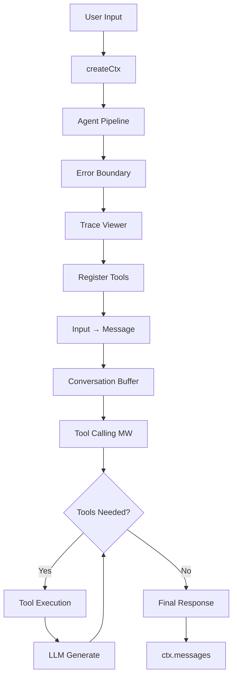

# Sisu - Architectural Overview

**Sisu** is a TypeScript framework for building reliable AI agents with complete transparency and control. Think "Express.js for AI agents" - it uses middleware pipelines to compose complex AI behavior from simple, testable pieces.

### Core Concept
```typescript
// Build agents like Express apps - composable middleware pipeline
const agent = new Agent()
  .use(errorBoundary())        // Error handling
  .use(traceViewer())          // Debug traces  
  .use(registerTools([...]))   // Function calling
  .use(toolCalling);           // LLM interaction

await agent.handler()(ctx);    // Single context flows through pipeline
```

### Key Architecture Points

- **🎯 Middleware-First**: Koa/Express-style `(ctx, next) => {}` pipeline processing
- **📦 Monorepo Structure**: 40+ packages - core, adapters, middleware, tools
- **🔄 Provider Agnostic**: Swap OpenAI ↔ Anthropic ↔ Ollama with one line change
- **🔍 Full Transparency**: Built-in HTML traces show every token, tool call, and decision
- **⚡ Type-Safe**: Strict TypeScript with comprehensive schemas and validation
- **🛡️ Production Ready**: Error boundaries, secret redaction, ≥80% test coverage

### What Problems It Solves

| Problem                              | Sisu Solution                                  |
|--------------------------------------|------------------------------------------------|
| "Where did my tokens go?"            | Built-in trace viewer shows every request      |
| "Why did my tool loop break?"        | Explicit middleware you can read and debug     |
| "Can't swap AI providers easily"     | Provider-agnostic adapters                     |
| "Production debugging is impossible" | Structured logging + HTML traces for every run |

**Bottom Line**: Sisu eliminates AI development guesswork through explicit control flow, comprehensive observability, and composable architecture. No black boxes, no magic - just reliable, debuggable AI agents.

## Table of Contents

1. [System Overview](#system-overview)
2. [Core Architecture Principles](#core-architecture-principles)
3. [Package Architecture](#package-architecture)
4. [Core Framework Design](#core-framework-design)
5. [Middleware System](#middleware-system)
6. [Adapter Pattern](#adapter-pattern)
7. [Tool System](#tool-system)
8. [Data Flow](#data-flow)
9. [Development Environment](#development-environment)
10. [Testing & Quality](#testing--quality)
11. [Deployment Patterns](#deployment-patterns)

---

## System Overview

**Sisu** is a TypeScript-first, monorepo-based framework for building reliable AI agents. The architecture is built around three core principles: **transparency**, **composability**, and **deterministic behavior**. 

### High-Level Architecture

```
┌─────────────────────────────────────────────────────────────────┐
│                         Sisu Framework                          │
├─────────────────┬─────────────────┬─────────────────┬───────────┤
│   Applications  │    Examples     │      Tools      │  Vector   │
│   (User Agents) │   (25+ demos)   │  (12+ built-in) │  Storage  │
├─────────────────┼─────────────────┼─────────────────┼───────────┤
│              Middleware Layer (20+ middleware)                  │
│  • Tool Calling  • Tracing  • Error Boundary  • RAG • Guards    │
├─────────────────────────────────────────────────────────────────┤
│                     Core Framework                              │
│        Context • Agent • Compose • Types • Utilities            │
├─────────────────────────────────────────────────────────────────┤
│                    Adapter Layer                                │
│              OpenAI • Anthropic • Ollama                        │
├─────────────────────────────────────────────────────────────────┤
│                   Foundation Layer                              │
│         Node.js • TypeScript • pnpm • Turbo • Vitest            │
└─────────────────────────────────────────────────────────────────┘
```

### Key Characteristics

- **Monorepo Architecture**: 40+ packages with clear separation of concerns
- **Koa-Style Middleware**: Express/Koa-inspired pipeline processing
- **Provider Agnostic**: Pluggable LLM adapters (OpenAI, Anthropic, Ollama)
- **Full TypeScript**: Strict mode with comprehensive type safety
- **Production Ready**: Built-in observability, error handling, and testing

---

## Core Architecture Principles

### 1. Transparency Over Magic
- **What You See Is What Runs**: No hidden state or implicit behavior
- **Full Observability**: Built-in tracing with HTML viewer generation
- **Explicit Control Flow**: Deterministic middleware pipeline execution
- **Structured Logging**: Comprehensive logging with secret redaction

### 2. Composability Over Monoliths
- **Small, Focused Packages**: Each package has a single responsibility
- **Middleware Pattern**: Compose complex behavior from simple functions
- **Tool Registration**: Pluggable tool system with schema validation
- **Adapter Interface**: Swap LLM providers without code changes

### 3. Safety & Reliability
- **Type Safety**: Strict TypeScript throughout the codebase
- **Error Boundaries**: Graceful error handling with structured errors
- **Guardrails**: Built-in safety constraints and validation
- **Testing**: ≥80% code coverage with comprehensive test suites

---

## Package Architecture

The Sisu framework is organized as a monorepo with clear package boundaries:

### Core Packages

#### `@sisu-ai/core` (v2.3.0)
**The foundational package providing essential types and utilities.**

- **Types**: `Ctx`, `Message`, `Tool`, `LLM`, `Middleware`
- **Composition**: `Agent` class and `compose()` utility
- **Context**: `createCtx()` factory with sensible defaults
- **Utilities**: Logging, KV storage, error handling
- **Size**: Minimal (~5KB), zero dependencies on AI providers

#### `@sisu-ai/server` (v7.0.0)
**HTTP server implementation for AI agent deployments.**

- RESTful API endpoints for agent execution
- Streaming response support
- Request/response middleware
- Production deployment patterns

### Adapter Packages

#### LLM Provider Adapters
- **`@sisu-ai/adapter-openai`**: OpenAI API integration (GPT-4, GPT-3.5, o1/o3 reasoning models)
- **`@sisu-ai/adapter-anthropic`**: Anthropic Claude integration
- **`@sisu-ai/adapter-ollama`**: Local Ollama model support

**Common Adapter Interface:**
```typescript
interface LLM {
  generate(messages: Message[], options?: GenerateOptions): Promise<GenerateResult>;
  // Optional streaming support
  stream?(messages: Message[], options?: GenerateOptions): AsyncIterable<ModelEvent>;
}
```

### Middleware Packages (20+ available)

#### Core Middleware
- **`@sisu-ai/mw-tool-calling`**: Function calling with loop detection
- **`@sisu-ai/mw-conversation-buffer`**: Context window management
- **`@sisu-ai/mw-error-boundary`**: Graceful error handling
- **`@sisu-ai/mw-trace-viewer`**: HTML trace generation

#### Advanced Middleware
- **`@sisu-ai/mw-rag`**: Retrieval Augmented Generation
- **`@sisu-ai/mw-guardrails`**: Safety constraints and validation
- **`@sisu-ai/mw-control-flow`**: Branching and routing logic
- **`@sisu-ai/mw-react-parser`**: ReAct (Reasoning + Acting) pattern
- **`@sisu-ai/mw-usage-tracker`**: Token and cost tracking

#### Utility Middleware
- **`@sisu-ai/mw-register-tools`**: Tool registration and management
- **`@sisu-ai/mw-invariants`**: Development-time validation
- **`@sisu-ai/mw-context-compressor`**: Context size optimization
- **`@sisu-ai/mw-cors`**: Cross-origin request handling

### Tool Packages (12+ available)

#### Web & Search Tools
- **`@sisu-ai/tool-web-search-*`**: DuckDuckGo, Google, OpenAI search
- **`@sisu-ai/tool-web-fetch`**: HTTP request handling
- **`@sisu-ai/tool-extract-urls`**: URL extraction from text

#### Storage Tools
- **`@sisu-ai/tool-aws-s3`**: AWS S3 integration
- **`@sisu-ai/tool-azure-blob`**: Azure Blob Storage
- **`@sisu-ai/tool-vec-chroma`**: Chroma vector database

#### Development Tools
- **`@sisu-ai/tool-terminal`**: Shell command execution
- **`@sisu-ai/tool-github-projects`**: GitHub API integration

#### Content Tools
- **`@sisu-ai/tool-wikipedia`**: Wikipedia API access
- **`@sisu-ai/tool-summarize-text`**: Text summarization

### Vector Packages
- **`@sisu-ai/vector-*`**: Vector storage and retrieval capabilities
- Pluggable backends for embedding storage
- Integration with RAG middleware

---

## Core Framework Design

### Context (`Ctx`) - The Heart of Sisu

The `Ctx` object is the single source of truth that flows through the entire middleware pipeline:

```typescript
interface Ctx {
  // Core state
  messages: Message[];          // Conversation history
  input?: string;              // Initial user input
  systemPrompt?: string;       // System instructions
  
  // Infrastructure
  model: LLM;                  // LLM adapter instance
  tools: ToolRegistry;         // Available tools
  log: Logger;                 // Structured logger
  signal: AbortSignal;         // Cancellation support
  kv: KeyValueStore;          // Ephemeral storage
  
  // Extensibility  
  state: Record<string, unknown>; // Middleware state namespace
}
```

### Agent Pipeline

```typescript
const agent = new Agent()
  .use(errorBoundary())           // 1. Error handling
  .use(traceViewer())             // 2. Observability
  .use(registerTools([...]))      // 3. Tool registration
  .use(inputToMessage)            // 4. Input transformation
  .use(conversationBuffer())      // 5. Context management
  .use(toolCalling);              // 6. LLM interaction + tools

await agent.handler()(ctx);
```

**Execution Flow:**
1. Context created with `createCtx()`
2. Middleware pipeline processes context sequentially
3. Each middleware can inspect, modify, or short-circuit
4. Final result available in `ctx.messages`

---

## Middleware System

### Middleware Contract

All middleware follows the Koa-inspired pattern:

```typescript
type Middleware<T> = (ctx: T, next: () => Promise<void>) => Promise<void>;
```

### Key Middleware Patterns

#### 1. Input/Output Transformation
```typescript
const inputToMessage = async (ctx, next) => {
  if (ctx.input) {
    ctx.messages.push({ role: 'user', content: ctx.input });
  }
  await next();
};
```

#### 2. Wrapping/Enhancement
```typescript
const errorBoundary = () => async (ctx, next) => {
  try {
    await next();
  } catch (error) {
    ctx.log.error('Pipeline error:', error);
    ctx.messages.push({
      role: 'assistant',
      content: 'Sorry, something went wrong.'
    });
  }
};
```

#### 3. State Management
```typescript
const usageTracker = () => async (ctx, next) => {
  const startTime = Date.now();
  await next();
  const duration = Date.now() - startTime;
  ctx.state.usage = { duration, tokens: calculateTokens(ctx) };
};
```

### Middleware Composition

Middleware can be composed using the `compose()` utility:

```typescript
const pipeline = compose([
  middleware1,
  middleware2,
  middleware3
]);

await pipeline(ctx);
```

---

## Adapter Pattern

### LLM Adapter Interface

All LLM providers implement a common interface:

```typescript
interface LLM {
  generate(
    messages: Message[],
    options?: GenerateOptions
  ): Promise<GenerateResult>;
  
  stream?(
    messages: Message[],
    options?: GenerateOptions
  ): AsyncIterable<ModelEvent>;
}
```

### Provider-Specific Features

#### OpenAI Adapter
- **Models**: GPT-4, GPT-4-turbo, GPT-3.5-turbo, o1/o3 reasoning models
- **Features**: Function calling, streaming, vision, reasoning details
- **Special**: Handles OpenAI-specific reasoning parameter format

#### Anthropic Adapter  
- **Models**: Claude 3.5 Sonnet, Claude 3 Haiku, Claude 3 Opus
- **Features**: Function calling, streaming, vision
- **Special**: Anthropic-specific message format handling

#### Ollama Adapter
- **Models**: Any locally hosted Ollama model
- **Features**: Local inference, custom models
- **Special**: No API key required, runs locally

### Adapter Swapping

Changing providers requires only a single line change:

```typescript
// OpenAI
const ctx = createCtx({
  model: openAIAdapter({ model: 'gpt-4o-mini' })
});

// Anthropic  
const ctx = createCtx({
  model: anthropicAdapter({ model: 'claude-3-5-sonnet-20241022' })
});

// Ollama
const ctx = createCtx({
  model: ollamaAdapter({ model: 'llama3.1:8b' })
});
```

---

## Tool System

### Tool Definition

Tools are functions with schema validation:

```typescript
interface Tool<TArgs = unknown, TResult = unknown> {
  name: string;
  description: string;
  schema: ZodSchema<TArgs>;
  handler: (args: TArgs, ctx?: ToolContext) => Promise<TResult>;
}
```

### Example Tool Implementation

```typescript
import { z } from 'zod';

const weatherTool: Tool<{ city: string }> = {
  name: 'getWeather',
  description: 'Get current weather for a city',
  schema: z.object({
    city: z.string().describe('City name')
  }),
  handler: async ({ city }) => {
    // Implementation
    return { city, temperature: 22, condition: 'sunny' };
  }
};
```

### Tool Registration

Tools are registered via middleware:

```typescript
const agent = new Agent()
  .use(registerTools([weatherTool, searchTool, calculatorTool]))
  .use(toolCalling);
```

### Tool Calling Flow

1. **Registration**: Tools registered in context
2. **Schema Exposure**: Tool schemas sent to LLM
3. **LLM Decision**: Model decides to call tools
4. **Validation**: Arguments validated against schema
5. **Execution**: Tool handler executed in safe context
6. **Response**: Results fed back to LLM

---

## Data Flow

### Request/Response Flow



### Message Flow

```typescript
// Initial state
ctx.messages = []

// After input transformation
ctx.messages = [
  { role: 'system', content: 'You are a helpful assistant.' },
  { role: 'user', content: 'What is the weather in Stockholm?' }
]

// After LLM generates tool calls
ctx.messages = [
  { role: 'system', content: 'You are a helpful assistant.' },
  { role: 'user', content: 'What is the weather in Stockholm?' },
  { 
    role: 'assistant', 
    content: '',
    tool_calls: [{ id: '123', name: 'getWeather', arguments: { city: 'Stockholm' } }]
  }
]

// After tool execution
ctx.messages = [
  { role: 'system', content: 'You are a helpful assistant.' },
  { role: 'user', content: 'What is the weather in Stockholm?' },
  { 
    role: 'assistant', 
    content: '',
    tool_calls: [{ id: '123', name: 'getWeather', arguments: { city: 'Stockholm' } }]
  },
  { 
    role: 'tool', 
    content: '{"city": "Stockholm", "temperature": 22, "condition": "sunny"}',
    tool_call_id: '123',
    name: 'getWeather'
  }
]

// After final LLM response
ctx.messages = [
  // ... previous messages ...
  { 
    role: 'assistant', 
    content: 'The weather in Stockholm is currently sunny with a temperature of 22°C.'
  }
]
```

---

## Development Environment

### Monorepo Structure

- **Package Manager**: pnpm@9.0.0 with workspace support
- **Build System**: Turbo@2 for fast, cached builds
- **Language**: TypeScript with strict mode
- **Node Version**: ≥18.17 required

### Build Pipeline

```bash
# Install dependencies
pnpm install

# Build all packages (with dependency resolution)
pnpm build

# Run specific package builds
pnpm --filter=@sisu-ai/core build

# Run examples
pnpm ex:openai:hello
```

### Development Workflow

1. **Code**: Edit source in `packages/*/src/`
2. **Build**: `pnpm build` (Turbo handles dependencies)
3. **Test**: `pnpm test` (Vitest with ≥80% coverage)
4. **Examples**: Run examples to validate changes
5. **Release**: Changesets for versioning

### Package Dependencies

```
@sisu-ai/core (peer dependency for all packages)
├── @sisu-ai/adapter-*
├── @sisu-ai/mw-*
├── @sisu-ai/tool-*
└── examples/* (dev dependencies)
```

---

## Testing & Quality

### Testing Strategy

- **Framework**: Vitest for all packages
- **Coverage**: ≥80% target with detailed reporting
- **Types**: TypeScript strict mode validation
- **Linting**: ESLint with recommended rules
- **CI/CD**: GitHub Actions for all PRs

### Test Categories

1. **Unit Tests**: Individual function/class testing
2. **Integration Tests**: Middleware pipeline testing  
3. **Adapter Tests**: LLM provider integration testing
4. **Tool Tests**: Tool execution and schema validation
5. **Example Tests**: End-to-end workflow validation

### Quality Gates

- ✅ All tests must pass
- ✅ Coverage ≥80% across all packages
- ✅ No TypeScript errors (`tsc --noEmit`)
- ✅ No ESLint warnings (`--max-warnings=0`)
- ✅ Examples must build and run

---

## Deployment Patterns

### Standalone Agent Applications

```typescript
// Basic deployment
const agent = new Agent()
  .use(errorBoundary())
  .use(traceViewer())
  .use(toolCalling);

const ctx = createCtx({ 
  model: openAIAdapter({ model: 'gpt-4o-mini' })
});

await agent.handler()(ctx);
```

### HTTP Server Deployment

```typescript
import { createServer } from '@sisu-ai/server';

const server = createServer({
  agent: myAgent,
  port: 3000
});

server.listen();
```

### Serverless Deployment

```typescript
// Vercel/Netlify function
export default async function handler(req, res) {
  const ctx = createCtx({
    model: openAIAdapter({ model: 'gpt-4o-mini' }),
    input: req.body.message
  });
  
  await agent.handler()(ctx);
  
  res.json({
    response: ctx.messages.filter(m => m.role === 'assistant').pop()?.content
  });
}
```

### Container Deployment

```dockerfile
FROM node:18-alpine
WORKDIR /app
COPY package*.json ./
RUN npm install
COPY . .
RUN npm run build
EXPOSE 3000
CMD ["npm", "start"]
```

---

## Advanced Features

### Reasoning Model Support

Sisu includes comprehensive support for reasoning models (o1, o3, ChatGPT 5.1):

- **Core Types**: `reasoning_details` field preservation
- **Request Options**: `reasoning` parameter support
- **Multi-turn Context**: Proper reasoning context preservation
- **Streaming**: Reasoning-aware token streaming

### Vector Storage & RAG

- **Vector Packages**: Multiple storage backend support
- **RAG Middleware**: Built-in retrieval augmented generation
- **Embedding Support**: Pluggable embedding providers

### Streaming & Real-time

- **Token Streaming**: Real-time response streaming
- **Event System**: Structured event emission
- **WebSocket Support**: Real-time agent interactions

### Observability & Debugging

- **HTML Traces**: Visual debugging with full request traces
- **Structured Logging**: Comprehensive logging with secret redaction
- **Usage Tracking**: Token and cost monitoring
- **Error Boundaries**: Graceful failure handling

---

## Conclusion

Sisu's architecture prioritizes **transparency**, **composability**, and **reliability** in AI agent development. The framework's middleware-based design, strong TypeScript foundations, and comprehensive tooling make it suitable for both rapid prototyping and production deployments.

Key architectural strengths:

- 🎯 **Predictable**: Explicit control flow with no hidden magic
- 🔧 **Composable**: Mix and match middleware, tools, and adapters
- 🔍 **Observable**: Built-in tracing and debugging capabilities
- 🛡️ **Reliable**: Strong typing, error boundaries, and comprehensive testing
- 🚀 **Scalable**: Monorepo structure supports large-scale development

The framework continues to evolve with active development focused on reasoning model support, production readiness validation, and expanded tool ecosystems.
