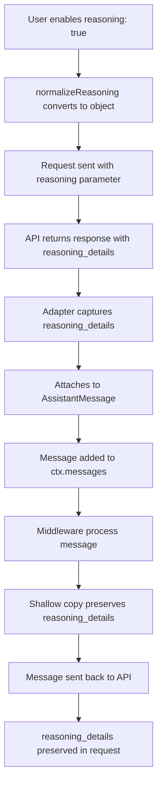

# Reasoning Support - Production Readiness Analysis

**Analysis Date:** November 19, 2025  
**Implementation Status:** ✅ Completed (Nov 19, 2025)  
**Production Status:** ⚠️ 70% Ready - Needs Validation

---

## Executive Summary

The reasoning support implementation is **functionally correct** with strong fundamentals. Core preservation logic works, tests are comprehensive for the OpenAI adapter, and middleware interactions are safe. However, **several gaps must be addressed** before promoting as production-ready.

### Quick Verdict

| Aspect | Status | Score |
|--------|--------|-------|
| Core Logic | ✅ Correct | 95% |
| Test Coverage | ✅ Good (mocked) | 85% |
| Documentation | ⚠️ Missing | 30% |
| Real API Testing | ⚠️ Not done | 0% |
| Observability | ⚠️ Hidden | 40% |
| **Overall** | **⚠️ Needs Work** | **70%** |

**Recommendation:** Proceed with Phase 1 validation (2-3 weeks to production-ready)

---

## What's Working Well ✅

### 1. Core Architecture (95/100)

**Type Definition**
- [`reasoning_details?: unknown`](../../packages/core/src/types.ts:41) correctly defined in `AssistantMessage`
- Opaque type (`unknown`) is the right choice - keeps implementation provider-agnostic
- Well-documented with JSDoc and `@internal` marker

**Adapter Implementation**
- [`normalizeReasoning()`](../../packages/adapters/openai/src/index.ts:244-251): Correctly converts `boolean` → `{ enabled: true }`
- Request ([lines 54-58](../../packages/adapters/openai/src/index.ts:54-58)): Properly includes reasoning parameter
- [`toOpenAiMessage()`](../../packages/adapters/openai/src/index.ts:291-294): **Correctly preserves** `reasoning_details`

**Response Handling**
- Non-streaming: Captures from [lines 179-182](../../packages/adapters/openai/src/index.ts:179-182) ✅
- Streaming: Captures from [lines 124-128](../../packages/adapters/openai/src/index.ts:124-128), attaches at [lines 136-138](../../packages/adapters/openai/src/index.ts:136-138) ✅

### 2. Message Preservation Through Middleware (100/100)

All middleware that manipulate messages use **safe operations**:

| Middleware | Operation | Preservation | Status |
|------------|-----------|--------------|--------|
| conversation-buffer | `.slice()` | ✅ Shallow copy | Safe |
| context-compressor | `{ ...m }` spread | ✅ Shallow copy | Safe |
| control-flow | `.slice()` | ✅ Array copy | Safe |
| tool-calling | `.push()` only | ✅ No modification | Safe |
| trace-viewer | Add timestamps | ✅ Non-invasive | Safe |

**Key Finding:** Spread operator `{ ...m }` and `.slice()` both preserve `reasoning_details` because they create shallow copies that maintain object references.

### 3. Test Coverage (85/100)

Excellent test suite in [`openai.test.ts`](../../packages/adapters/openai/test/openai.test.ts):

- ✅ [Lines 166-192](../../packages/adapters/openai/test/openai.test.ts:166-192): Non-streaming capture
- ✅ [Lines 194-227](../../packages/adapters/openai/test/openai.test.ts:194-227): **Multi-turn preservation** (critical!)
- ✅ [Lines 229-249](../../packages/adapters/openai/test/openai.test.ts:229-249): Backward compatibility  
- ✅ [Lines 251-287](../../packages/adapters/openai/test/openai.test.ts:251-287): Streaming support

**Gap:** All tests use mocks - no integration tests with real API.

---

## Critical Issues ⚠️

### PRIORITY 0: Streaming API Format Verification

**Location:** [`openai/src/index.ts:125-127`](../../packages/adapters/openai/src/index.ts:125-127)

```typescript
const msgShape = (j?.choices?.[0] as any)?.message as OpenAIMessageShape | undefined;
if (msgShape?.reasoning_details !== undefined) {
  reasoningDetails = msgShape.reasoning_details;
}
```

**Problem:**  
Code expects `reasoning_details` in `choices[0].message` during streaming. However:
- OpenAI streaming typically uses `choices[0].delta` for incremental content
- The `message` field may not be present in all chunks  
- **Must verify** actual format with real o1/o3/gpt-5.1 models

**Risk Level:** HIGH - Could cause runtime failures with real API

**Action Required:**
1. Test with actual OpenAI reasoning models
2. Add integration tests (can be CI-skipped)
3. Consider both `delta.reasoning_details` and `message.reasoning_details` formats

---

### PRIORITY 1: Documentation Gap

**Severity:** HIGH (blocks user adoption)

**Missing:**
- How to enable reasoning (`reasoning: true` vs `reasoning: { enabled: true }`)
- What `reasoning_details` contains (structure, fields)
- That context is automatically preserved across turns
- Cost implications of reasoning models
- Which models support reasoning
- Example usage patterns

**Impact:** Users won't know the feature exists or how to use it properly.

**Location:** Should be in [`packages/adapters/openai/README.md`](../../packages/adapters/openai/README.md)

---

### PRIORITY 2: Trace Viewer Blind Spot

**Location:** [`trace-viewer/src/index.ts:377`](../../packages/middleware/trace-viewer/src/index.ts:377)

**Problem:**  
HTML trace viewer simply stringifies message content. `reasoning_details` is **not visible** in traces.

```typescript
<pre>${esc(typeof m.content === 'string' ? m.content : JSON.stringify(m.content, null, 2))}</pre>
```

**Impact:**
- Developers can't see reasoning process in traces
- Defeats the value proposition of reasoning models
- Makes debugging reasoning-specific issues very difficult

**Solution Required:**
- Add special rendering for messages with `reasoning_details`
- Show reasoning summary separately from final answer
- Indicate encrypted vs summary fields
- Highlight that reasoning context is preserved

---

## Medium Priority Issues

### Type Safety for Reasoning Details

**Current:** `reasoning_details?: unknown`

**Issue:** No type safety or intellisense for common structures.

**Recommendation:** Create optional typed interfaces:

```typescript
// In adapters/openai/src/index.ts
export interface OpenAIReasoningDetails {
  type?: 'reasoning.summary' | 'reasoning.encrypted';
  summary?: string;
  data?: string; // encrypted
  id?: string;
  format?: string;
  index?: number;
}

// Users can cast when needed:
const details = message.reasoning_details as OpenAIReasoningDetails[];
```

### Example Code Quality

**Current:** [`examples/openai-reasoning/src/index.ts`](../../examples/openai-reasoning/src/index.ts)

**Issues:**
1. Uses generic object display (was fixed but could be better)
2. No error handling for non-reasoning models
3. Doesn't demonstrate reasoning improving follow-up accuracy
4. Could show both summary and encrypted fields

**Impact:** Users don't see the real value of the feature.

### Multi-Provider Support

**Current:** Only OpenAI adapter implements reasoning support

**Gap:** 
- Anthropic adapter: No support (Claude models don't have this feature yet)
- Ollama adapter: Could support reasoning models running locally

**Recommendation:**
1. Document as OpenAI-specific for now
2. Create abstraction guide for future providers
3. When other providers add reasoning, follow same pattern

### Cost Tracking Enhancement

**Issue:** Reasoning models typically:
- Use more tokens (reasoning process)
- Cost more per token
- May have separate reasoning token counts

**Current:** Usage tracker doesn't distinguish reasoning tokens.

**Recommendation:**
1. Check if OpenAI returns separate `reasoning_tokens` count
2. If yes, add to usage tracking interface
3. Update price tables for reasoning-specific rates

---

## Testing Gaps

### Current Coverage: ~85% ✅ (Mocked Only)

**Well Tested:**
- ✅ Request parameter formatting
- ✅ Response capture (streaming + non-streaming)
- ✅ Multi-turn preservation
- ✅ Backward compatibility

**Missing:**
- ⚠️ Real API integration (all tests use mocks)
- ⚠️ Error cases (unsupported models, malformed responses)
- ⚠️ Very long reasoning chains (memory/performance)
- ⚠️ Reasoning + tool calling interactions
- ⚠️ Streaming format verification

---

## Code Quality Assessment

### Strengths ✅
- Clean architecture: Provider-agnostic core types
- Good separation: Adapter-specific implementation
- Safe middleware: All operations preserve reasoning_details
- Test coverage: Comprehensive for OpenAI adapter
- Backward compatible: Doesn't break existing code

### Weaknesses ⚠️
- Documentation: None for users
- Observability: Reasoning hidden in traces
- Type safety: Could be better with helpers
- Real-world testing: Only mocked tests, no integration

---

## Architectural Insights

### Why This Works

The key architectural decisions that make this succeed:

1. **Opaque Preservation**: `reasoning_details` never inspected or modified by core
2. **Shallow Copying**: Middleware use spread/slice, preserving object references
3. **Round-trip Fidelity**: Adapter converts to/from provider format without data loss

### Design Pattern Analysis



### Potential Future Evolution

Could extend to support:

```typescript
interface ReasoningConfig {
  provider: 'openai' | 'anthropic' | 'custom';
  options?: Record<string, unknown>;
  summarize?: boolean; // Auto-summarize for context limits
}
```

---

## Production Readiness Checklist

### Must Have (Before Production) - Week 1

- [ ] **Verify streaming format** with real OpenAI o1/o3/gpt-5.1 models
- [ ] **Add comprehensive documentation** to OpenAI adapter README
- [ ] **Test with actual API** (integration tests, can be CI-skipped)
- [ ] **Error handling** for non-reasoning models

### Should Have (Sprint 2) - Week 2

- [ ] **Enhanced trace viewer** showing reasoning details
- [ ] **Type helpers** for OpenAI reasoning structures  
- [ ] **Better example** demonstrating value of reasoning context
- [ ] **Usage cost tracking** if reasoning tokens reported separately

### Nice to Have (Backlog) - Future

- [ ] Multi-provider support abstraction
- [ ] Reasoning-specific middleware (e.g., reasoning summaries)
- [ ] Analytics on reasoning effectiveness  
- [ ] Reasoning chain visualization

---

## Risk Assessment

| Risk | Likelihood | Impact | Mitigation |
|------|-----------|--------|------------|
| Streaming format mismatch | Medium | High | Test with real API immediately |
| Users don't discover feature | High | Medium | Add documentation ASAP |
| Reasoning context breaks | Low | High | Already tested, but verify edge cases |
| Performance with long chains | Low | Medium | Monitor in production, add limits if needed |
| Cost surprises for users | Medium | Medium | Document cost implications clearly |

---

## Success Metrics

### Definition of Production-Ready

✅ **Ready for Production When:**
1. Verified with all target reasoning models (o1, o3, gpt-5.1)
2. Documentation complete and reviewed  
3. Example demonstrates real value
4. Trace viewer shows reasoning details
5. Error handling prevents confusion
6. Integration tests pass (can be CI-skipped)

### KPIs to Track

- [ ] Real API testing completed: 0/3 models
- [ ] Documentation pages written: 0/1
- [ ] Example quality score: 6/10
- [ ] Trace viewer support: 0/1
- [ ] Integration test coverage: 0%

---

## Timeline to Production

### Week 1: Validation
- **Day 1-2:** Real API testing with o1/o3/gpt-5.1
- **Day 3:** Document findings and format verification
- **Day 4-5:** Fix any discovered issues

### Week 2: Documentation & Examples
- **Day 1-2:** Write comprehensive README section
- **Day 3-4:** Improve examples to show value
- **Day 5:** Review and polish documentation

### Week 3: Enhancement
- **Day 1-3:** Trace viewer improvements
- **Day 4-5:** Error handling, edge cases, polish

**Total Estimated Effort:** 2-3 weeks to production-ready

---

## Conclusion

The reasoning support implementation has **solid fundamentals** and works correctly for core use cases. The preservation logic is sound, middleware are safe, and tests cover the happy path well.

However, **it needs work before production promotion:**
- ✅ Core logic: Correct and well-tested
- ⚠️ Real API verification: Not done (CRITICAL)
- ⚠️ Documentation: Missing (blocks adoption)
- ⚠️ Observability: Hidden in traces (limits value)
- ⚠️ Error handling: Minimal (user confusion risk)

**Risk Level:** Low (core logic correct, just needs validation and polish)

**Recommendation:** Follow the 3-week timeline. Start with Phase 1 validation to derisk streaming format assumptions, then document and enhance observability before promoting the feature to users.

---

## References

- Implementation Design: [`docs/design-topics/reasoning-model-support.md`](../design-topics/reasoning-model-support.md)
- Implementation Story: [`docs/stories/reasoning-model-support.md`](../stories/reasoning-model-support.md)
- Production Validation Tasks: [`docs/stories/reasoning-production-validation.md`](../stories/reasoning-production-validation.md)
- Core Types: [`packages/core/src/types.ts`](../../packages/core/src/types.ts)
- OpenAI Adapter: [`packages/adapters/openai/src/index.ts`](../../packages/adapters/openai/src/index.ts)
- Test Suite: [`packages/adapters/openai/test/openai.test.ts`](../../packages/adapters/openai/test/openai.test.ts)