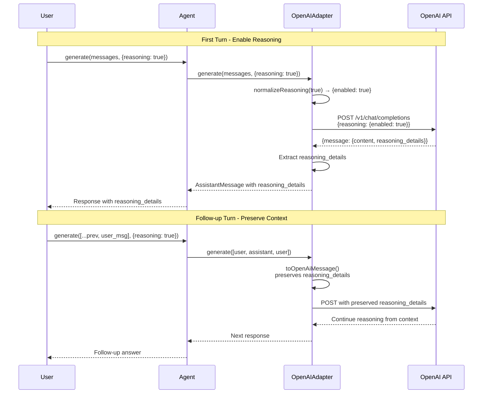

# Reasoning Model Support - Implementation Summary

## Overview

This document provides a high-level summary of the changes needed to support reasoning models (o1, o3, ChatGPT 5.1) in the Sisu framework.

## Data Flow Diagram



## Architecture Changes

```mermaid
graph TB
    subgraph "Core Types packages/core/src/types.ts"
        A1[AssistantMessage] -->|Add| A2[reasoning_details?: unknown]
        B1[GenerateOptions] -->|Add| B2[reasoning?: boolean | object]
    end
    
    subgraph "OpenAI Adapter packages/adapters/openai/src/index.ts"
        C1[generate function] -->|Update| C2[Add reasoning to request body]
        C3[Response parsing] -->|Update| C4[Capture reasoning_details]
        C5[toOpenAiMessage] -->|Update| C6[Preserve reasoning_details]
        C7[Type definitions] -->|Update| C8[Add reasoning_details field]
    end
    
    subgraph "New Functions"
        D1[normalizeReasoning]
    end
    
    subgraph "Tests packages/adapters/openai/test/"
        E1[Request tests]
        E2[Response tests]
        E3[Conversation tests]
        E4[Backward compat tests]
    end
    
    A2 -.->|Used by| C4
    B2 -.->|Used by| C2
    D1 -.->|Called by| C2
    C6 -.->|Uses| A2
```

## File Modification Summary

| File | Lines Modified | Type | Description |
|------|---------------|------|-------------|
| [`packages/core/src/types.ts`](packages/core/src/types.ts:29) | ~35 | Addition | Add `reasoning_details` to AssistantMessage |
| [`packages/core/src/types.ts`](packages/core/src/types.ts:54) | ~63 | Addition | Add `reasoning` to GenerateOptions |
| [`packages/adapters/openai/src/index.ts`](packages/adapters/openai/src/index.ts:7) | ~12 | Modification | Update type definitions |
| [`packages/adapters/openai/src/index.ts`](packages/adapters/openai/src/index.ts:41) | ~50 | Modification | Add reasoning to request body |
| [`packages/adapters/openai/src/index.ts`](packages/adapters/openai/src/index.ts:157) | ~160 | Modification | Capture reasoning_details in response |
| [`packages/adapters/openai/src/index.ts`](packages/adapters/openai/src/index.ts:219) | ~248 | Modification | Preserve reasoning_details in conversion |
| `packages/adapters/openai/src/index.ts` | After 217 | Addition | New `normalizeReasoning()` function |
| `packages/adapters/openai/test/openai.test.ts` | End of file | Addition | 6 new test cases |
| `examples/reasoning-model.ts` | New file | Addition | Usage example |
| `packages/adapters/openai/README.md` | End of file | Addition | Documentation section |

## Key Implementation Points

### 1. Type Safety
- `reasoning_details` is typed as `unknown` (opaque, provider-specific)
- No parsing or validation of reasoning_details content
- Preserves data integrity when round-tripping

### 2. Backward Compatibility
- All changes are **additive** (optional fields)
- Existing code continues to work without modification
- Non-reasoning models ignore the parameter

### 3. Normalization
```typescript
// Boolean input
reasoning: true  →  { enabled: true }

// Object pass-through
reasoning: { enabled: true }  →  { enabled: true }

// Undefined/not provided
reasoning: undefined  →  (omitted from request)
```

### 4. Message Flow
```
User Input
    ↓
[GenerateOptions with reasoning: true]
    ↓
[Request body with reasoning: {enabled: true}]
    ↓
[API returns message with reasoning_details]
    ↓
[AssistantMessage with reasoning_details preserved]
    ↓
[Next turn: reasoning_details sent back to API]
    ↓
[Model continues reasoning from context]
```

## Implementation Order

1. **Core Types** (no dependencies)
   - Update [`AssistantMessage`](packages/core/src/types.ts:29)
   - Update [`GenerateOptions`](packages/core/src/types.ts:54)

2. **OpenAI Type Definitions** (depends on core)
   - Update `OpenAIMessageShape`
   - Update `OpenAIChatMessage`

3. **Helper Function** (standalone)
   - Add `normalizeReasoning()`

4. **Request Generation** (depends on helper)
   - Update request body construction
   - Add reasoning parameter

5. **Response Parsing** (depends on types)
   - Capture `reasoning_details`
   - Attach to AssistantMessage

6. **Message Conversion** (depends on types)
   - Update [`toOpenAiMessage()`](packages/adapters/openai/src/index.ts:219)
   - Preserve `reasoning_details` field

7. **Testing** (depends on all above)
   - Request parameter tests
   - Response capture tests
   - Conversation preservation tests
   - Backward compatibility tests

8. **Documentation & Examples** (final step)
   - Example code
   - README updates

## Testing Strategy

### Unit Tests (6 new tests)
1. ✅ Boolean reasoning parameter normalized correctly
2. ✅ Object reasoning parameter passed through
3. ✅ reasoning_details captured from response
4. ✅ reasoning_details preserved in multi-turn
5. ✅ Backward compatible (works without reasoning)
6. ✅ No reasoning_details for normal models

### Integration Considerations
- Manual testing with actual o1/o3/ChatGPT 5.1 models
- Verify reasoning context improves multi-turn quality
- Test with OpenRouter API (alternative endpoint)

## Success Criteria

- ✅ All existing tests pass (no regressions)
- ✅ All 6 new tests pass
- ✅ TypeScript compiles without errors
- ✅ Example code runs successfully
- ✅ Documentation is complete and clear

## Risks & Mitigations

| Risk | Impact | Mitigation |
|------|--------|------------|
| Breaking existing code | High | All changes are optional/additive |
| Provider API changes | Medium | Use opaque type for reasoning_details |
| Type complexity | Low | Keep types simple (unknown for opaque data) |
| Testing without API access | Low | Comprehensive mocks, optional manual testing |

## Related Documentation

- [Design Document](reasoning-model-support.md) - Full technical design
- [User Story](../stories/reasoning-model-support.md) - Implementation steps and acceptance criteria
- [OpenAI o1 Documentation](https://platform.openai.com/docs/guides/reasoning) - Official docs
- [OpenRouter API Docs](https://openrouter.ai/docs) - Alternative endpoint

## Quick Reference: Key Changes

### Before (Current)
```typescript
// Types don't support reasoning
interface AssistantMessage {
  role: 'assistant';
  content: string;
  tool_calls?: ToolCall[];
}

// Can't enable reasoning
const response = await llm.generate(messages);

// No reasoning data preserved
const nextMessages = [...messages, response.message];
```

### After (With Support)
```typescript
// Types support reasoning
interface AssistantMessage {
  role: 'assistant';
  content: string;
  tool_calls?: ToolCall[];
  reasoning_details?: unknown;  // NEW
}

// Enable reasoning
const response = await llm.generate(messages, {
  reasoning: true  // NEW
});

// Reasoning context preserved automatically
const nextMessages = [...messages, response.message];
// response.message includes reasoning_details if present
```

## Next Steps

After approval of this plan:

1. Switch to **Code mode** for implementation
2. Implement changes in order listed above
3. Run tests after each major change
4. Create changeset for version bump
5. Update main README if needed

## Questions for Review

1. Is the `unknown` type appropriate for `reasoning_details`?
   - ✅ Yes - provider-specific, opaque data
2. Should we validate reasoning parameter values?
   - ✅ No - let API validate, we just normalize
3. Should we support reasoning in streaming mode?
   - ✅ Yes - already covered in design
4. Should other adapters (Anthropic, Ollama) get reasoning support?
   - ⚠️ OpenAI-specific feature; others don't have equivalent