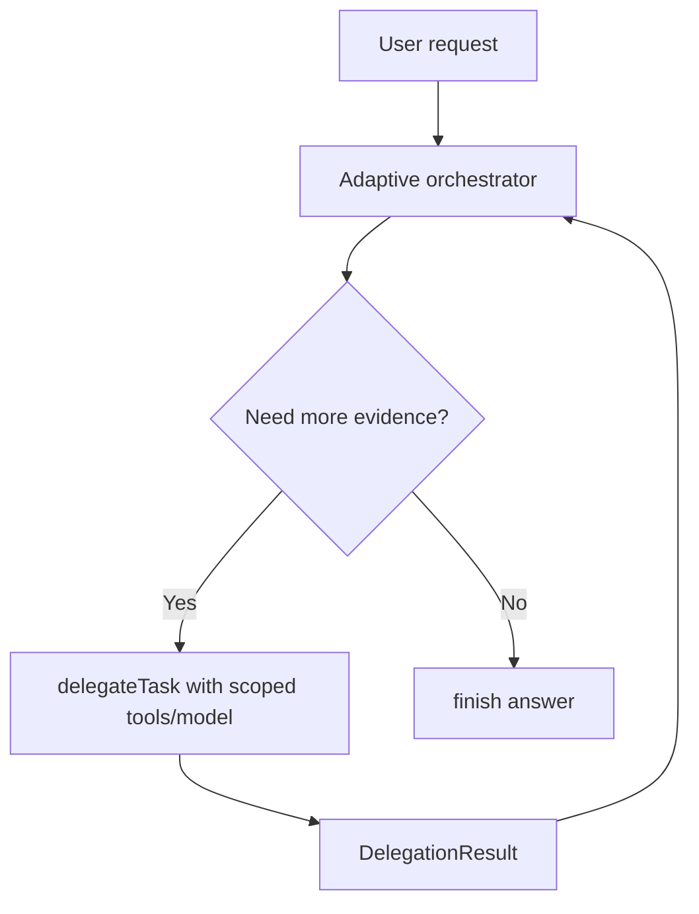
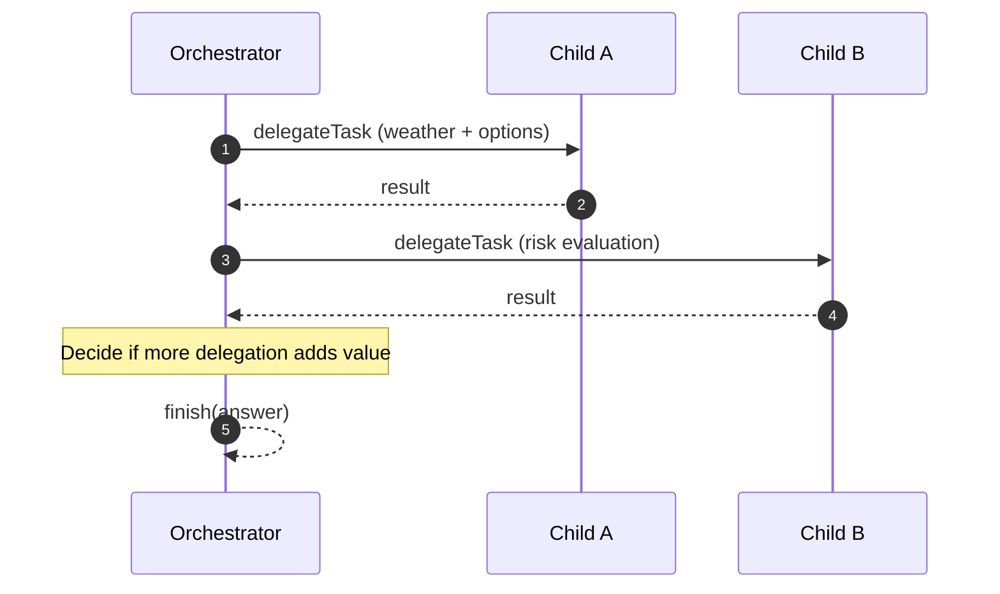

# OpenAI Adaptive Orchestration Example

Demonstrates **policy-bounded autonomous delegation** with `@sisu-ai/mw-orchestration`.

Unlike the fixed-phase orchestration example, this one does **not** force a predefined sequence. The orchestrator decides dynamically whether delegation is worthwhile.

## What this example demonstrates

- The model controls **when/how often** to call `delegateTask`
- Delegations remain strictly scoped (tools/model per child)
- Orchestrator stops when confidence is sufficient, then calls `finish`
- Full traceability through `delegate.start`, `delegate.result`, and `finish`

## Delegation model

## Run

- Quick start: `pnpm ex:openai:orchestration-adaptive`
- Alternate with prompt:
  - `TRACE_HTML=1 pnpm --filter=openai-orchestration-adaptive dev -- --trace -- "Plan an evening in Malmö with fallback options"`

## Environment

- `API_KEY` (required)
- `MODEL` (optional, default `gpt-4o-mini`)
- `BASE_URL` (optional, for OpenAI-compatible endpoints)
- `TRACE_HTML=1` and/or `TRACE_JSON=1` for trace output
