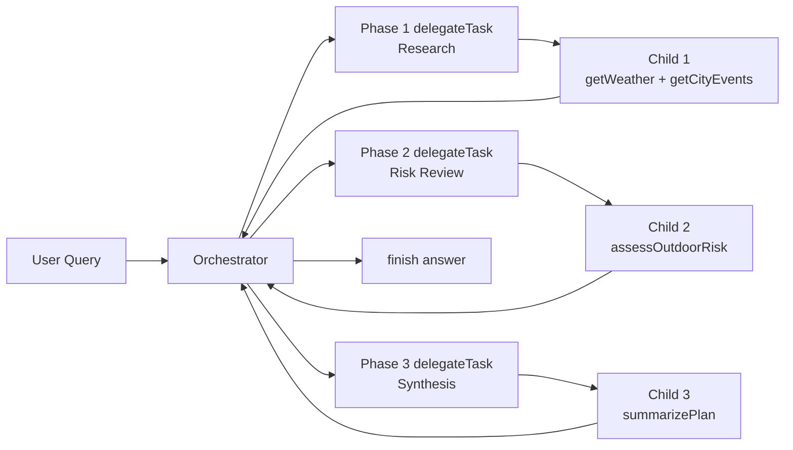
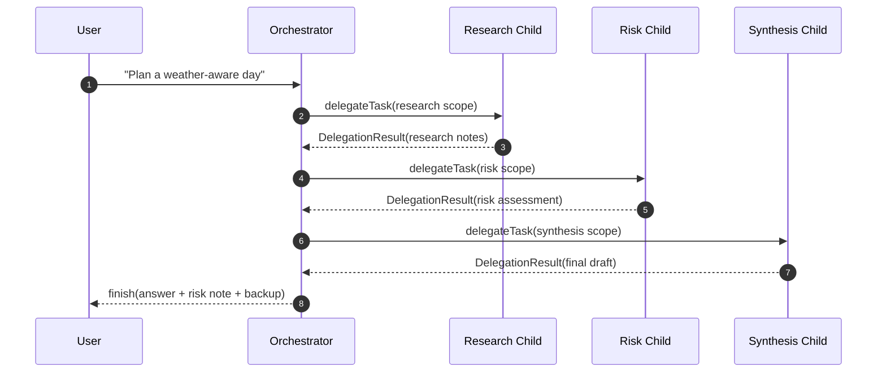

# OpenAI Orchestration Example

Demonstrates orchestration-driven delegated execution with `@sisu-ai/mw-orchestration`.

## What this example shows

- Orchestrator control surface constrained to `delegateTask` and `finish`
- Three specialized delegated phases: research → risk review → synthesis
- Per-delegation tool/model scoping (different child tool allow-lists per phase)
- Trace generation with explicit parent-child linkage metadata

## Orchestration design

## Run

- Quick start: `pnpm ex:openai:orchestration`
- Alternate: `TRACE_HTML=1 pnpm --filter=openai-orchestration dev -- --trace -- "Plan a weather-aware day in Malmö"`

## Environment

- `API_KEY` (required)
- `MODEL` (optional, default `gpt-5.4`)
- `BASE_URL` (optional, for OpenAI-compatible endpoints)
- `TRACE_HTML=1` and/or `TRACE_JSON=1` for trace output

## Expected behavior

1. The orchestrator receives the user task.
2. It delegates a **research** child (`getWeather`, `getCityEvents`).
3. It delegates a **risk** child (`assessOutdoorRisk`).
4. It delegates a **synthesis** child (`summarizePlan`).
5. It calls `finish` with a final plan + risk note + backup option.

In logs you should typically see multiple `delegate.start` / `delegate.result` events before `finish`.
