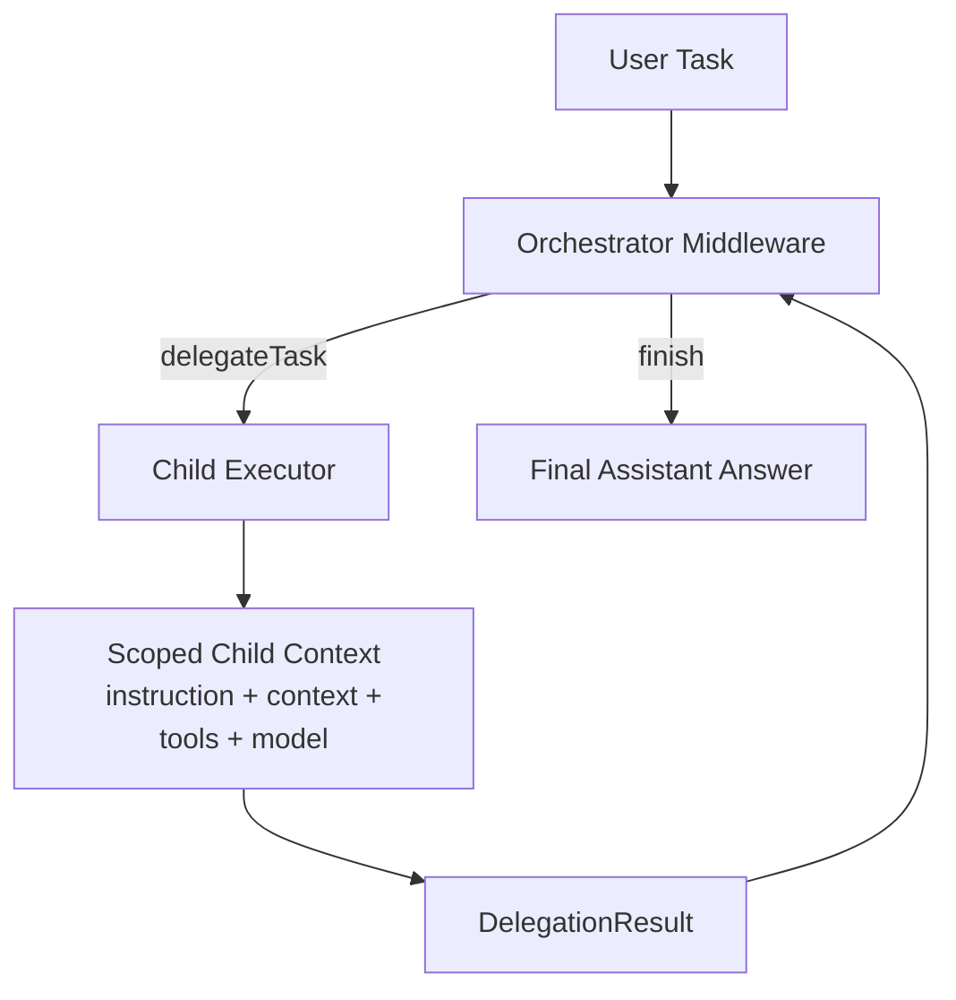
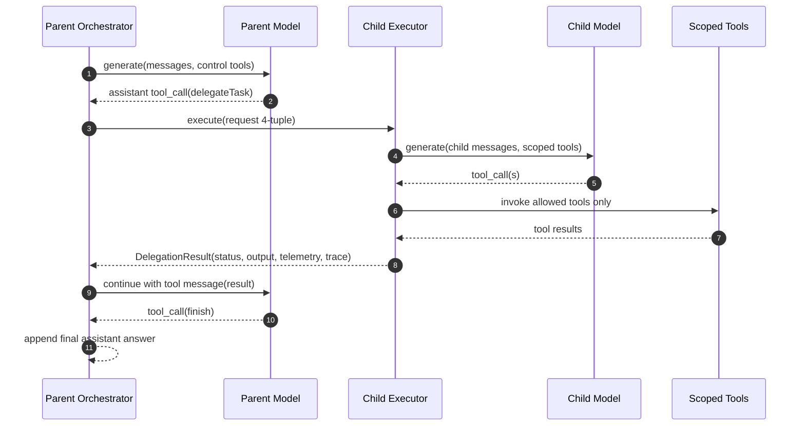

# @sisu-ai/mw-orchestration

Orchestration middleware for delegated multi-agent execution in Sisu.

## Install

```bash
pnpm add @sisu-ai/mw-orchestration
```

## What it does

- Constrains orchestrator control actions to `delegateTask` and `finish`
- Delegates child work using a strict 4-tuple (`instruction`, `context`, `tools`, `model`)
- Tracks runtime state in `ctx.state.orchestration`
- Supports pluggable child executors (built-in inline executor included)
- Emits explicit orchestration events for tracing/observability

## Flow





## Usage

```ts
import { Agent } from "@sisu-ai/core";
import { orchestration } from "@sisu-ai/mw-orchestration";

const app = new Agent()
  .use(
    orchestration({
      allowedModels: ["gpt-4o-mini"],
      maxDelegations: 6,
      defaultTimeoutMs: 30_000,
    }),
  );
```

## Integration notes

- Use with `@sisu-ai/mw-register-tools` to expose parent tool registry for child scoping.
- Child executions are compatible with `@sisu-ai/mw-tool-calling` style tool semantics.
- Usage rollup can consume metrics written by `@sisu-ai/mw-usage-tracker`.
- Traces can be viewed with `@sisu-ai/mw-trace-viewer` using parent-child run linkage in orchestration state.
