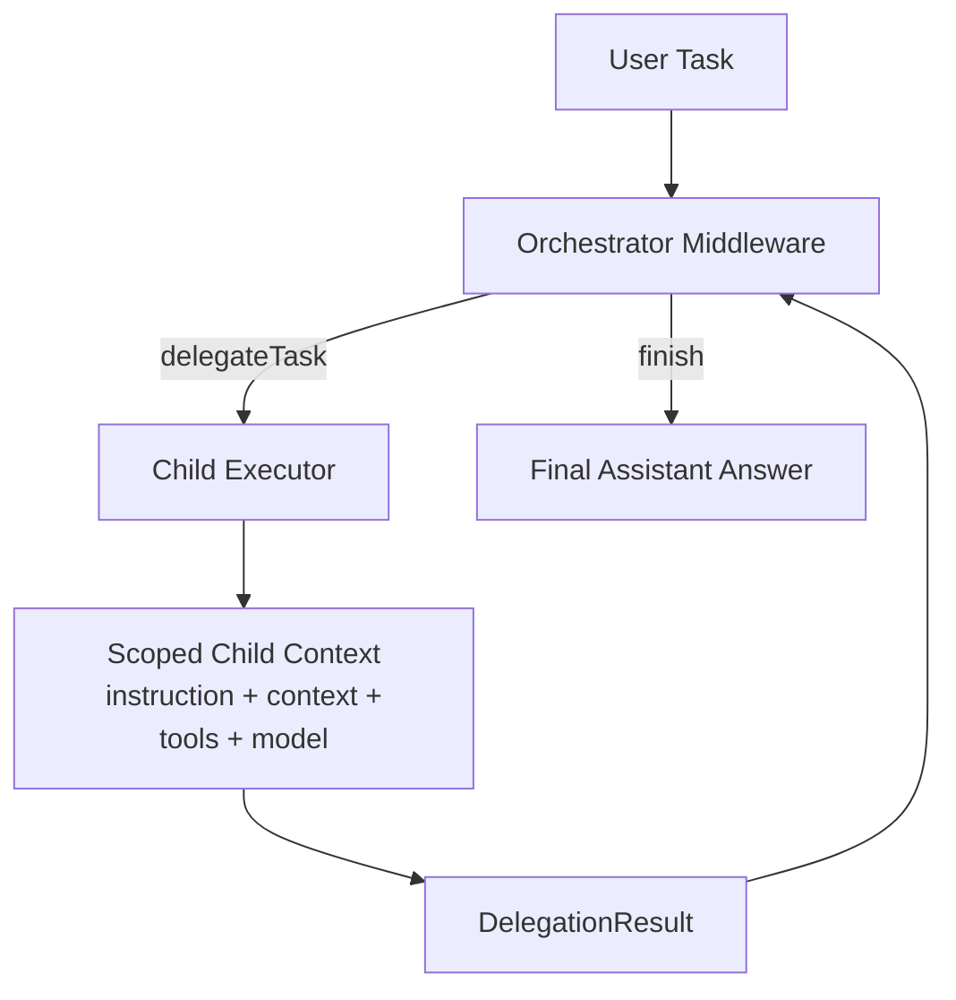
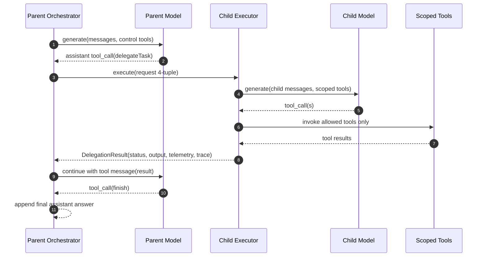

# @sisu-ai/mw-orchestration

Orchestrate delegated multi-agent execution with scoped children, explicit traces, and policy hooks.

## Install

```bash
pnpm add @sisu-ai/mw-orchestration
```

## What it does

- Constrains orchestrator control actions to `delegateTask` and `finish`
- Delegates child work using a strict 4-tuple (`instruction`, `context`, `tools`, `model`)
- Tracks runtime state in `ctx.state.orchestration`
- Supports pluggable child executors (built-in inline executor included)
- Emits explicit orchestration events for tracing/observability

## Policy hooks and self-correction

The middleware supports pluggable policy hooks so behavior can be hardened without example-specific logic:

- `normalizeDelegationInput(raw, ctx)`
- `validateDelegation(input, ctx)`
- `resolveToolScope(input, ctx)`
- `modelResolver(modelRef, ctx)`

Delegation failures use a structured error contract (`code`, `message`, `hint`, `details`) so models can self-correct on the next `delegateTask` call.

## Flow





## Usage

```ts
import { Agent } from "@sisu-ai/core";
import { orchestration } from "@sisu-ai/mw-orchestration";

const app = new Agent()
  .use(
    orchestration({
      allowedModels: ["gpt-5.4"],
      maxDelegations: 6,
      defaultTimeoutMs: 30_000,
    }),
  );
```

## Integration notes

- Use with `@sisu-ai/mw-register-tools` to expose parent tool registry for child scoping.
- Child executions are compatible with `@sisu-ai/mw-tool-calling` style tool semantics.
- Usage rollup can consume metrics written by `@sisu-ai/mw-usage-tracker`.
- Traces can be viewed with `@sisu-ai/mw-trace-viewer` using parent-child run linkage in orchestration state.

---

## Documentation

**Core** — [Package docs](packages/core/README.md) · [Error types](packages/core/ERROR_TYPES.md)

**Adapters** — [OpenAI](packages/adapters/openai/README.md) · [Anthropic](packages/adapters/anthropic/README.md) · [Ollama](packages/adapters/ollama/README.md)

<details>
<summary>All middleware packages</summary>

- [@sisu-ai/mw-agent-run-api](packages/middleware/agent-run-api/README.md)
- [@sisu-ai/mw-context-compressor](packages/middleware/context-compressor/README.md)
- [@sisu-ai/mw-control-flow](packages/middleware/control-flow/README.md)
- [@sisu-ai/mw-conversation-buffer](packages/middleware/conversation-buffer/README.md)
- [@sisu-ai/mw-cors](packages/middleware/cors/README.md)
- [@sisu-ai/mw-error-boundary](packages/middleware/error-boundary/README.md)
- [@sisu-ai/mw-guardrails](packages/middleware/guardrails/README.md)
- [@sisu-ai/mw-invariants](packages/middleware/invariants/README.md)
- [@sisu-ai/mw-orchestration](packages/middleware/orchestration/README.md)
- [@sisu-ai/mw-rag](packages/middleware/rag/README.md)
- [@sisu-ai/mw-react-parser](packages/middleware/react-parser/README.md)
- [@sisu-ai/mw-register-tools](packages/middleware/register-tools/README.md)
- [@sisu-ai/mw-tool-calling](packages/middleware/tool-calling/README.md)
- [@sisu-ai/mw-trace-viewer](packages/middleware/trace-viewer/README.md)
- [@sisu-ai/mw-usage-tracker](packages/middleware/usage-tracker/README.md)
</details>

<details>
<summary>All tool packages</summary>

- [@sisu-ai/tool-aws-s3](packages/tools/aws-s3/README.md)
- [@sisu-ai/tool-azure-blob](packages/tools/azure-blob/README.md)
- [@sisu-ai/tool-extract-urls](packages/tools/extract-urls/README.md)
- [@sisu-ai/tool-github-projects](packages/tools/github-projects/README.md)
- [@sisu-ai/tool-rag](packages/tools/rag/README.md)
- [@sisu-ai/tool-summarize-text](packages/tools/summarize-text/README.md)
- [@sisu-ai/tool-terminal](packages/tools/terminal/README.md)
- [@sisu-ai/tool-web-fetch](packages/tools/web-fetch/README.md)
- [@sisu-ai/tool-web-search-duckduckgo](packages/tools/web-search-duckduckgo/README.md)
- [@sisu-ai/tool-web-search-google](packages/tools/web-search-google/README.md)
- [@sisu-ai/tool-web-search-openai](packages/tools/web-search-openai/README.md)
- [@sisu-ai/tool-wikipedia](packages/tools/wikipedia/README.md)
</details>

<details>
<summary>All RAG packages</summary>

- [@sisu-ai/rag-core](packages/rag/core/README.md)
</details>

<details>
<summary>All vector packages</summary>

- [@sisu-ai/vector-core](packages/vector/core/README.md)
- [@sisu-ai/vector-chroma](packages/vector/chroma/README.md)
</details>

<details>
<summary>All examples</summary>

**Anthropic** — [hello](examples/anthropic-hello/README.md) · [control-flow](examples/anthropic-control-flow/README.md) · [stream](examples/anthropic-stream/README.md) · [weather](examples/anthropic-weather/README.md)

**Ollama** — [hello](examples/ollama-hello/README.md) · [stream](examples/ollama-stream/README.md) · [vision](examples/ollama-vision/README.md) · [weather](examples/ollama-weather/README.md) · [web-search](examples/ollama-web-search/README.md)

**OpenAI** — [hello](examples/openai-hello/README.md) · [weather](examples/openai-weather/README.md) · [stream](examples/openai-stream/README.md) · [vision](examples/openai-vision/README.md) · [reasoning](examples/openai-reasoning/README.md) · [react](examples/openai-react/README.md) · [control-flow](examples/openai-control-flow/README.md) · [branch](examples/openai-branch/README.md) · [parallel](examples/openai-parallel/README.md) · [graph](examples/openai-graph/README.md) · [orchestration](examples/openai-orchestration/README.md) · [orchestration-adaptive](examples/openai-orchestration-adaptive/README.md) · [guardrails](examples/openai-guardrails/README.md) · [error-handling](examples/openai-error-handling/README.md) · [rag-chroma](examples/openai-rag-chroma/README.md) · [web-search](examples/openai-web-search/README.md) · [web-fetch](examples/openai-web-fetch/README.md) · [wikipedia](examples/openai-wikipedia/README.md) · [terminal](examples/openai-terminal/README.md) · [github-projects](examples/openai-github-projects/README.md) · [server](examples/openai-server/README.md) · [aws-s3](examples/openai-aws-s3/README.md) · [azure-blob](examples/openai-azure-blob/README.md)
</details>

---

## Contributing

We build Sisu in the open. Contributions welcome.

[Contributing Guide](CONTRIBUTING.md) · [Report a Bug](https://github.com/finger-gun/sisu/issues/new?template=bug_report.md) · [Request a Feature](https://github.com/finger-gun/sisu/issues/new?template=feature_request.md) · [Code of Conduct](CODE_OF_CONDUCT.md)

---

<div align="center">

**[Star on GitHub](https://github.com/finger-gun/sisu)** if Sisu helps you build better agents.

*Quiet, determined, relentlessly useful.*

[Apache 2.0 License](LICENSE)

</div>
