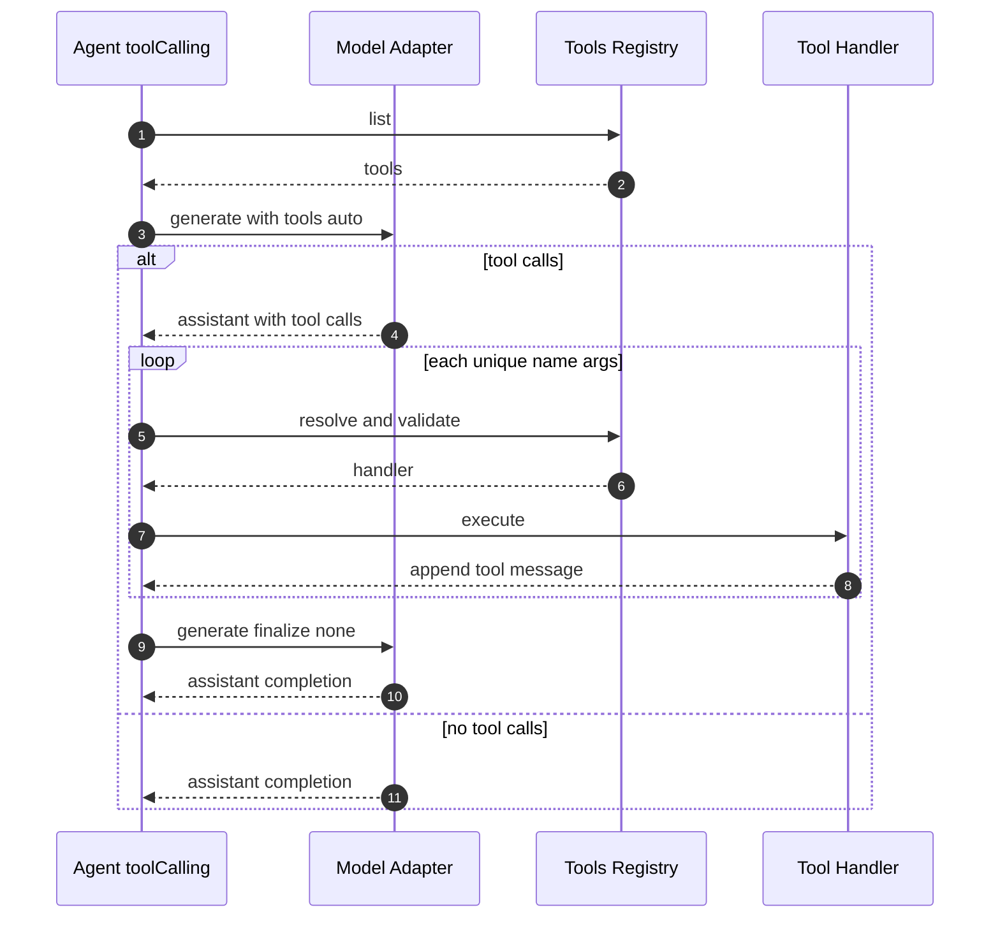
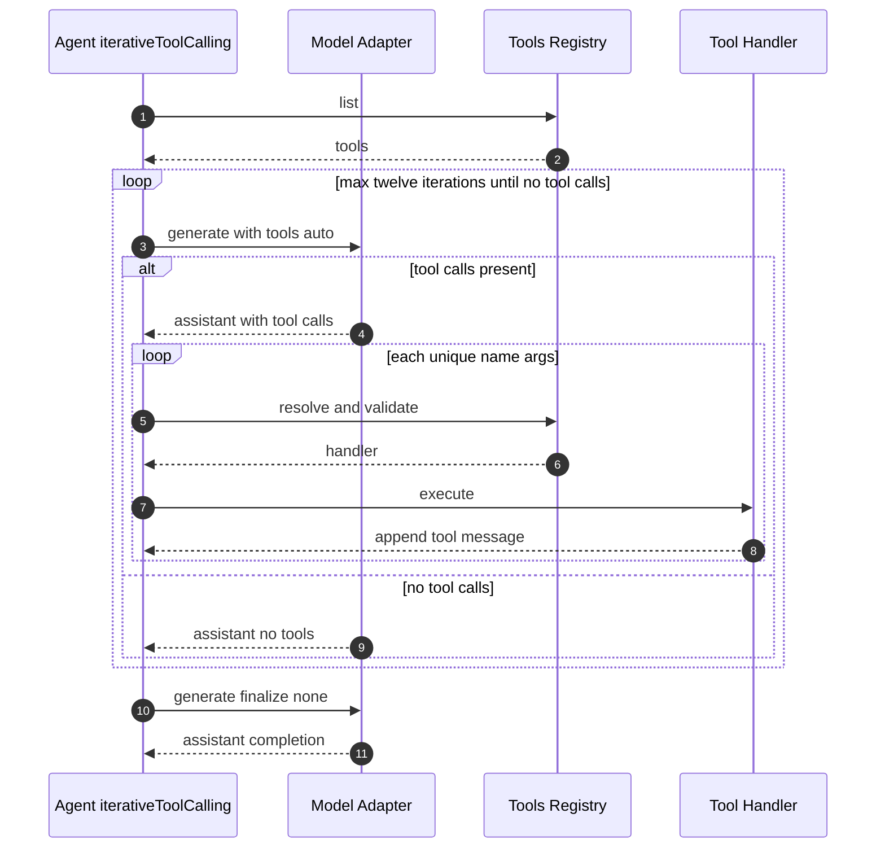

# @sisu-ai/mw-tool-calling
[](https://github.com/finger-gun/sisu/actions/workflows/tests.yml)
[](https://github.com/finger-gun/sisu/blob/main/LICENSE)
[](https://www.npmjs.com/package/@sisu-ai/mw-tool-calling)
[](https://github.com/finger-gun/sisu/blob/main/CONTRIBUTING.md)

Native tools API loop for providers that support tool calls.

## Setup
```bash
npm i @sisu-ai/mw-tool-calling
```

## Documentation
Discover what you can do through examples or documentation. Check it out at https://github.com/finger-gun/sisu

## Behavior
- `toolCalling`: single-round tool calling.
  - First turn: calls `ctx.model.generate(messages, { tools, toolChoice:'auto' })`.
  - If assistant returns `tool_calls`, appends the assistant message and executes each tool.
    - Executes each unique `(name, args)` once and responds to every `tool_call_id`.
    - Handles provider quirks by reusing last args for identical tool names with missing args.
  - Second turn: asks for a pure completion (`toolChoice:'none'`).

- `iterativeToolCalling`: multi-round tool calling.
  - Repeats calls with `toolChoice:'auto'` until the model returns a message with no `tool_calls` (max 12 iters).



## Usage
```ts
import { toolCalling, iterativeToolCalling } from '@sisu-ai/mw-tool-calling';

// Single-round
agent.use(toolCalling);

// OR multi-round
agent.use(iterativeToolCalling);
```

# Community & Support
- [Code of Conduct](https://github.com/finger-gun/sisu/blob/main/CODE_OF_CONDUCT.md)
- [Contributing Guide](https://github.com/finger-gun/sisu/blob/main/CONTRIBUTING.md)
- [License](https://github.com/finger-gun/sisu/blob/main/LICENSE)
- [Report a Bug](https://github.com/finger-gun/sisu/issues/new?template=bug_report.md)
- [Request a Feature](https://github.com/finger-gun/sisu/issues/new?template=feature_request.md)
